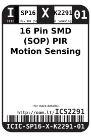
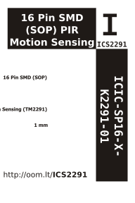

Contents
========

* [ICIC-SP16-X-K2291-01>16 Pin SMD (SOP) PIR Motion Sensing (TM2291)](#icic-sp16-x-k2291-0116-pin-smd-sop-pir-motion-sensing-tm2291)
	* [Datasheets](#datasheets)
	* [Labels](#labels)
	* [EDA](#eda)
		* [Symbols](#symbols)
	* [Tags](#tags)

# ICIC-SP16-X-K2291-01>16 Pin SMD (SOP) PIR Motion Sensing (TM2291)

- ID: ICIC-SP16-X-K2291-01
- Name: ICIC-SP16-X-K2291-01

## Datasheets

- Datasheet: [datasheet.pdf](datasheet.pdf)

## Labels
  
  

|Front|Inventory|Specifications|
| :---: | :---: | :---: |
||||

## EDA

### Symbols

## Tags

- hexID: ICS2291
- oompSort: ICICSP16K2291
- oompType: ICIC
- oompSize: SP16
- oompColor: X
- oompDesc: K2291
- oompIndex: 01
- oompVersion: 98
- ooNumPins: 16
- ooDesignator: U1
