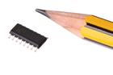
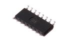
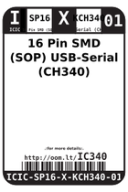
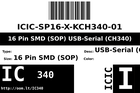
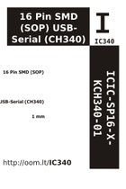

Contents
========

* [IC340 > 16 Pin SMD (SOP) USB-Serial (CH340)](#ic340--16-pin-smd-sop-usb-serial-ch340)
	* [Images](#images)
	* [Datasheets](#datasheets)
	* [Labels](#labels)
	* [EDA](#eda)
	* [Tags](#tags)
  
![][im]
# IC340 > 16 Pin SMD (SOP) USB-Serial (CH340)

- ID: ICIC-SP16-X-KCH340-01
- Hex ID: IC340
- Name: 16 Pin SMD (SOP) USB-Serial (CH340)
- Description: 16 Pin SMD (SOP) USB-Serial (CH340)

## Images
  
  

|image|image_RE|image_BOTTOM|label-front|label-inventory|label-spec|
| :---: | :---: | :---: | :---: | :---: | :---: |
|||||||

## Datasheets

- Datasheet: [datasheet.pdf](datasheet.pdf)

## Labels
  
  

|label-front|label-inventory|label-spec|
| :---: | :---: | :---: |
||||

## EDA

### Symbols

## Tags

- oompID: ICIC-SP16-X-KCH340-01
- name: 16 Pin SMD (SOP) USB-Serial (CH340)
- hexID: IC340
- oompSort: 
- oompClass: Surface Mount
- oompClassCode: SDMS
- oompType: ICIC
- oompSize: SP16
- oompColor: X
- oompDesc: KCH340
- oompIndex: 01
- oompVersion: 99
- ooNumPins: 16
- ooPin1: GND
- ooPin2: TXD
- ooPin3: RXD
- ooPin4: V3
- ooPin5: UD+
- ooPin6: UD-
- ooPin7: X1
- ooPin8: X0
- ooPin9: CTS#
- ooPin10: DSR#
- ooPin11: RI#
- ooPin12: DCD#
- ooPin13: DTR#
- ooPin14: RTS#
- ooPin15: R232
- ooPin16: VCC
- ooDesignator: U1

[im]: image_450.jpg
