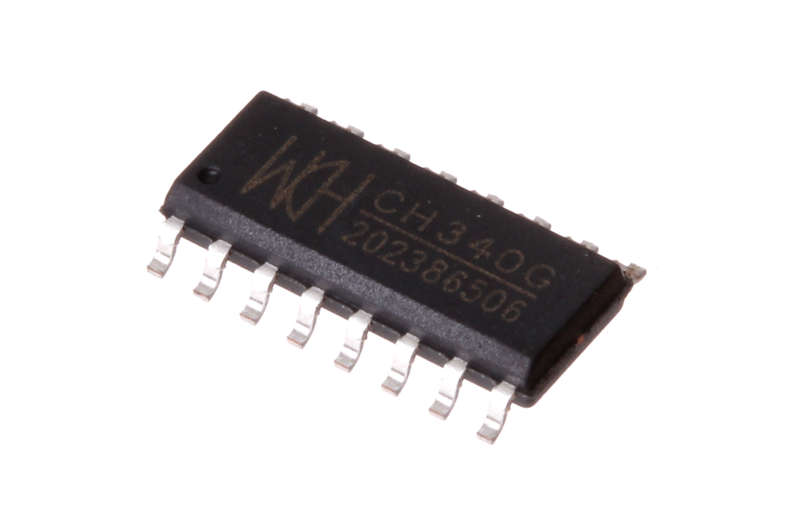
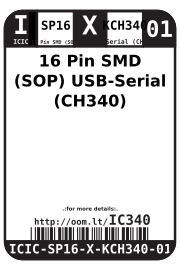

Contents
========

* [ICIC-SP16-X-KCH340-01>16 Pin SMD (SOP) USB-Serial (CH340)](#icic-sp16-x-kch340-0116-pin-smd-sop-usb-serial-ch340)
	* [Images](#images)
	* [Datasheets](#datasheets)
	* [Labels](#labels)
	* [EDA](#eda)
		* [Symbols](#symbols)
	* [Tags](#tags)
  
![][im]
# ICIC-SP16-X-KCH340-01>16 Pin SMD (SOP) USB-Serial (CH340)

- ID: ICIC-SP16-X-KCH340-01
- Name: ICIC-SP16-X-KCH340-01

## Images
  
  

|Main|Reference|Bottom|
| :---: | :---: | :---: |
||||

## Datasheets

- Datasheet: [datasheet.pdf](datasheet.pdf)

## Labels
  
  

|Front|Inventory|Specifications|
| :---: | :---: | :---: |
||||

## EDA

### Symbols

## Tags

- hexID: IC340
- oompSort: 
- oompClass: Surface Mount
- oompClassCode: SDMS
- oompType: ICIC
- oompSize: SP16
- oompColor: X
- oompDesc: KCH340
- oompIndex: 01
- oompVersion: 99
- ooNumPins: 16
- ooPin1: GND
- ooPin2: TXD
- ooPin3: RXD
- ooPin4: V3
- ooPin5: UD+
- ooPin6: UD-
- ooPin7: X1
- ooPin8: X0
- ooPin9: CTS#
- ooPin10: DSR#
- ooPin11: RI#
- ooPin12: DCD#
- ooPin13: DTR#
- ooPin14: RTS#
- ooPin15: R232
- ooPin16: VCC
- ooDesignator: U1

[im]: image_600.jpg
