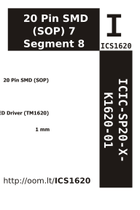

Contents
========

* [ICS1620 >  20 Pin SMD (SOP) 7 Segment 8 Digit LED Driver (TM1620) ](#ics1620---20-pin-smd-sop-7-segment-8-digit-led-driver-tm1620-)
	* [Datasheets](#datasheets)
	* [Labels](#labels)
	* [EDA](#eda)
	* [Images](#images)
	* [Tags](#tags)

# ICS1620 >  20 Pin SMD (SOP) 7 Segment 8 Digit LED Driver (TM1620) 

- ID: ICIC-SP20-X-K1620-01
- Hex ID: ICS1620
- Name:  20 Pin SMD (SOP) 7 Segment 8 Digit LED Driver (TM1620) 
- Description:  20 Pin SMD (SOP) 7 Segment 8 Digit LED Driver (TM1620) 
- Long Link: [http://oom.lt/ICIC-SP20-X-K1620-01](http://oom.lt/ICIC-SP20-X-K1620-01)
- Short Link: [http://oom.lt/ICS1620](http://oom.lt/ICS1620)

## Datasheets

- Datasheet: [datasheet.pdf](datasheet.pdf)

## Labels
  
  

|label-front|label-inventory|label-spec|
| :---: | :---: | :---: |
||||

## EDA

### Symbols

## Images
  
  

|label-front|label-inventory|label-spec|
| :---: | :---: | :---: |
||||

## Tags

- oompID: ICIC-SP20-X-K1620-01
- name:  20 Pin SMD (SOP) 7 Segment 8 Digit LED Driver (TM1620) 
- hexID: ICS1620
- oompSort: ICICSP20K1620
- oompType: ICIC
- oompSize: SP20
- oompColor: X
- oompDesc: K1620
- oompIndex: 01
- oompVersion: 98
- ooPin1: VDD
- ooPin2: SEG1
- ooPin3: SEG2
- ooPin4: SEG3
- ooPin5: SEG4
- ooPin6: SEG5
- ooPin7: SEG6
- ooPin8: SEG7
- ooPin9: SEG8
- ooPin10: GRID6
- ooPin11: GRID5
- ooPin12: GND
- ooPin13: GRID4
- ooPin14: GRID3
- ooPin15: GND
- ooPin16: GRID2
- ooPin17: GRID1
- ooPin18: DIN
- ooPin19: CLK
- ooPin20: STB
- oompBbls: template;ICIC-SP20-X-XXXX-01-bbls
- oompDiag: template;ICIC-SP20-X-XXXX-01-diag
- oompIden: template;ICIC-SP20-X-XXXX-01-iden
- oompSimp: template;ICIC-SP20-X-XXXX-01-simp
- ooPackageMarking: TM1620
- ooDesignator: U1
