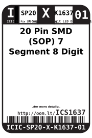
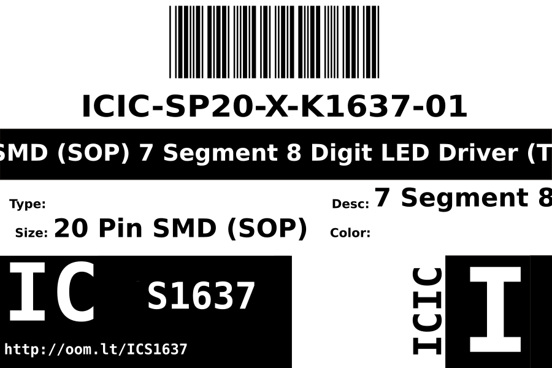
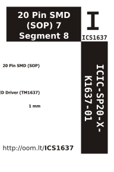

Contents
========

* [ICIC-SP20-X-K1637-01>20 Pin SMD (SOP) 7 Segment 8 Digit LED Driver (TM1637)](#icic-sp20-x-k1637-0120-pin-smd-sop-7-segment-8-digit-led-driver-tm1637)
	* [Datasheets](#datasheets)
	* [Labels](#labels)
	* [EDA](#eda)
		* [Symbols](#symbols)
	* [Tags](#tags)

# ICIC-SP20-X-K1637-01>20 Pin SMD (SOP) 7 Segment 8 Digit LED Driver (TM1637)

- ID: ICIC-SP20-X-K1637-01
- Name: ICIC-SP20-X-K1637-01

## Datasheets

- Datasheet: [datasheet.pdf](datasheet.pdf)

## Labels
  
  

|Front|Inventory|Specifications|
| :---: | :---: | :---: |
||||

## EDA

### Symbols

## Tags

- oompID: ICIC-SP20-X-K1637-01
- name: 20 Pin SMD (SOP) 7 Segment 8 Digit LED Driver (TM1637)
- hexID: ICS1637
- oompSort: ICICSP20K1637
- oompType: ICIC
- oompSize: SP20
- oompColor: X
- oompDesc: K1637
- oompIndex: 01
- oompVersion: 98
- ooNumPins: 6
- ooPin1: GND
- ooPin2: SEG1/KS1
- ooPin3: SEG2/KS2
- ooPin4: SEG3/KS3
- ooPin5: SEG4/KS4
- ooPin6: SEG5/KS5
- ooPin7: SEG6/KS6
- ooPin8: SEG7/KS7
- ooPin9: SEG8/KS8
- ooPin10: GRID6
- ooPin11: GRID5
- ooPin12: GRID4
- ooPin13: GRID3
- ooPin14: GRID2
- ooPin15: GRID1
- ooPin16: VDD
- ooPin17: DIO
- ooPin18: CLK
- ooPin19: K1
- ooPin20: K2
- oompBbls: template;ICIC-SP20-X-XXXX-01-bbls
- oompDiag: template;ICIC-SP20-X-XXXX-01-diag
- oompIden: template;ICIC-SP20-X-XXXX-01-iden
- oompSimp: template;ICIC-SP20-X-XXXX-01-simp
- ooPackageMarking: TM1637
- ooDesignator: U1
