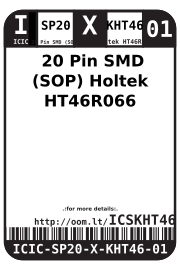
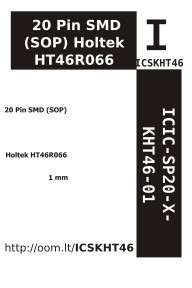

Contents
========

* [ICIC-SP20-X-KHT46-01> 20 Pin SMD (SOP) Holtek HT46R066 ](#icic-sp20-x-kht46-01-20-pin-smd-sop-holtek-ht46r066-)
	* [Datasheets](#datasheets)
	* [Labels](#labels)
	* [EDA](#eda)
		* [Symbols](#symbols)
	* [Tags](#tags)

# ICIC-SP20-X-KHT46-01> 20 Pin SMD (SOP) Holtek HT46R066 

- ID: ICIC-SP20-X-KHT46-01
- Name: ICIC-SP20-X-KHT46-01

## Datasheets

- Datasheet: [datasheet.pdf](datasheet.pdf)

## Labels
  
  

|Front|Inventory|Specifications|
| :---: | :---: | :---: |
||||

## EDA

### Symbols

## Tags

- oompID: ICIC-SP20-X-KHT46-01
- name:  20 Pin SMD (SOP) Holtek HT46R066 
- hexID: ICSKHT46
- oompSort: ICICSP20KHT46
- oompType: ICIC
- oompSize: SP20
- oompColor: X
- oompDesc: KHT46
- oompIndex: 01
- oompVersion: 98
- ooPin1: PA3/INT/AN3
- ooPin2: PA2/TC0/AN2
- ooPin3: PA1/TC0/AN1
- ooPin4: PA0/AN0
- ooPin5: VSS/GND
- ooPin6: PC0/AN4
- ooPin7: PC1/AN5
- ooPin8: PB0/SCOM0
- ooPin9: PB1/SCOM1
- ooPin10: PB2/SCOM2
- ooPin11: PB3/SCOM3
- ooPin12: PB4/TC0
- ooPin13: PB5/INT
- ooPin14: PC2
- ooPin15: PC3/PWM1
- ooPin16: VDD
- ooPin17: PA7/RES
- ooPin18: PA6/OSC1
- ooPin19: PA5/OSC2
- ooPin20: PA4/PWM0/TC1
- oompBbls: template;ICIC-SP20-X-XXXX-01-bbls
- oompDiag: template;ICIC-SP20-X-XXXX-01-diag
- oompIden: template;ICIC-SP20-X-XXXX-01-iden
- oompSimp: template;ICIC-SP20-X-XXXX-01-simp
- ooPackageMarking: HT46R066B
- ooDesignator: U1
