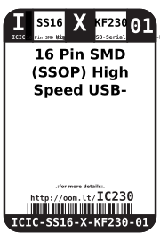
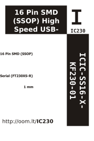

Contents
========

* [ICIC-SS16-X-KF230-01>16 Pin SMD (SSOP) High Speed USB-Serial (FT230XS-R)](#icic-ss16-x-kf230-0116-pin-smd-ssop-high-speed-usb-serial-ft230xs-r)
	* [Datasheets](#datasheets)
	* [Labels](#labels)
	* [EDA](#eda)
		* [Symbols](#symbols)
	* [Tags](#tags)

# ICIC-SS16-X-KF230-01>16 Pin SMD (SSOP) High Speed USB-Serial (FT230XS-R)

- ID: ICIC-SS16-X-KF230-01
- Name: ICIC-SS16-X-KF230-01

## Datasheets

- Datasheet: [datasheet.pdf](datasheet.pdf)

## Labels
  
  

|label-front|label-inventory|label-spec|
| :---: | :---: | :---: |
||||

## EDA

### Symbols

## Tags

- oompID: ICIC-SS16-X-KF230-01
- name: 16 Pin SMD (SSOP) High Speed USB-Serial (FT230XS-R)
- hexID: IC230
- oompSort: ICICSS16KF230
- oompType: ICIC
- oompSize: SS16
- oompColor: X
- oompDesc: KF230
- oompIndex: 01
- oompVersion: 98
- ooDesignator: U1
