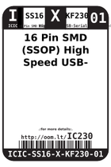
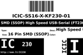

Contents
========

* [IC230 > 16 Pin SMD (SSOP) High Speed USB-Serial (FT230XS-R)](#ic230--16-pin-smd-ssop-high-speed-usb-serial-ft230xs-r)
	* [Datasheets](#datasheets)
	* [Labels](#labels)
	* [EDA](#eda)
	* [Images](#images)
	* [Tags](#tags)

# IC230 > 16 Pin SMD (SSOP) High Speed USB-Serial (FT230XS-R)

- ID: ICIC-SS16-X-KF230-01
- Hex ID: IC230
- Name: 16 Pin SMD (SSOP) High Speed USB-Serial (FT230XS-R)
- Description: 16 Pin SMD (SSOP) High Speed USB-Serial (FT230XS-R)
- Long Link: [http://oom.lt/ICIC-SS16-X-KF230-01](http://oom.lt/ICIC-SS16-X-KF230-01)
- Short Link: [http://oom.lt/IC230](http://oom.lt/IC230)

## Datasheets

- Datasheet: [datasheet.pdf](datasheet.pdf)

## Labels
  
  

|label-front|label-inventory|label-spec|
| :---: | :---: | :---: |
||||

## EDA

### Symbols

## Images
  
  

|label-front|label-inventory|label-spec|
| :---: | :---: | :---: |
||||

## Tags

- oompID: ICIC-SS16-X-KF230-01
- name: 16 Pin SMD (SSOP) High Speed USB-Serial (FT230XS-R)
- hexID: IC230
- oompSort: ICICSS16KF230
- oompType: ICIC
- oompSize: SS16
- oompColor: X
- oompDesc: KF230
- oompIndex: 01
- oompVersion: 98
- ooDesignator: U1
