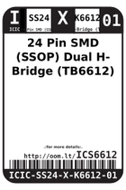
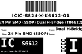
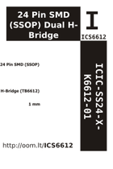

Contents
========

* [ICS6612 > 24 Pin SMD (SSOP) Dual H-Bridge (TB6612)](#ics6612--24-pin-smd-ssop-dual-h-bridge-tb6612)
	* [Datasheets](#datasheets)
	* [Labels](#labels)
	* [EDA](#eda)
	* [Images](#images)
	* [Tags](#tags)

# ICS6612 > 24 Pin SMD (SSOP) Dual H-Bridge (TB6612)

- ID: ICIC-SS24-X-K6612-01
- Hex ID: ICS6612
- Name: 24 Pin SMD (SSOP) Dual H-Bridge (TB6612)
- Description: 24 Pin SMD (SSOP) Dual H-Bridge (TB6612)
- Long Link: [http://oom.lt/ICIC-SS24-X-K6612-01](http://oom.lt/ICIC-SS24-X-K6612-01)
- Short Link: [http://oom.lt/ICS6612](http://oom.lt/ICS6612)

## Datasheets

- Datasheet: [datasheet.pdf](datasheet.pdf)

## Labels
  
  

|label-front|label-inventory|label-spec|
| :---: | :---: | :---: |
||||

## EDA

### Symbols

## Images
  
  

|label-front|label-inventory|label-spec|
| :---: | :---: | :---: |
||||

## Tags

- oompID: ICIC-SS24-X-K6612-01
- name: 24 Pin SMD (SSOP) Dual H-Bridge (TB6612)
- hexID: ICS6612
- oompSort: ICICSS24K6612
- oompType: ICIC
- oompSize: SS24
- oompColor: X
- oompDesc: K6612
- oompIndex: 01
- oompVersion: 98
- ooNumPins: 24
- ooDesignator: U
