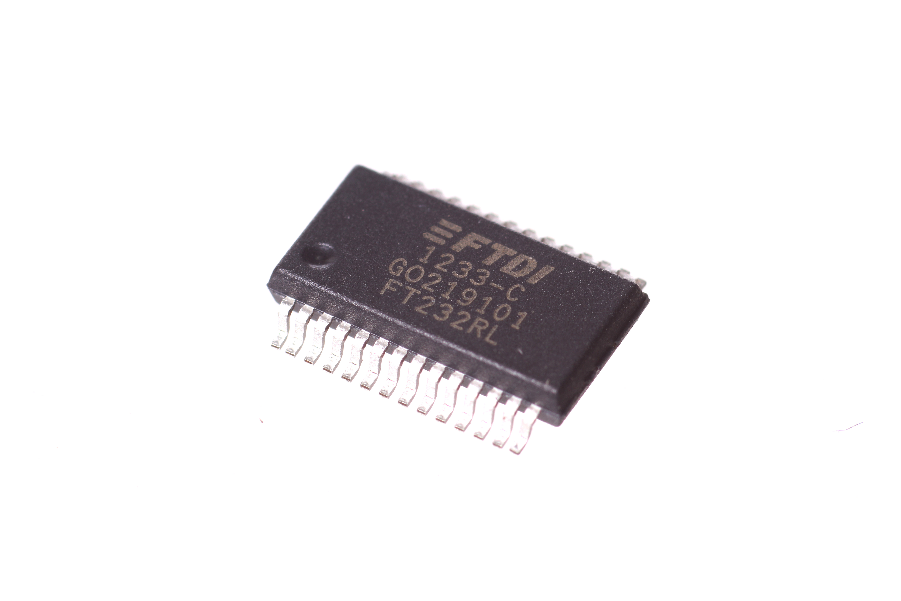
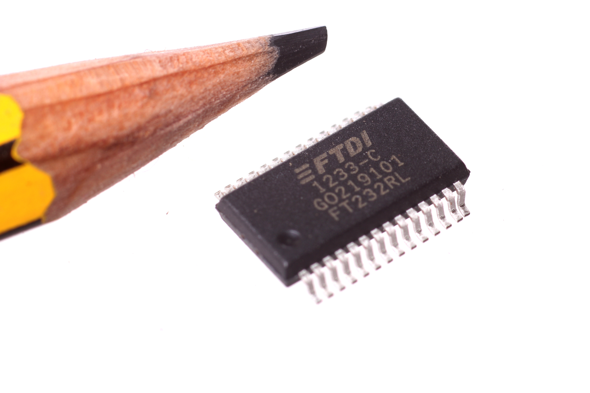
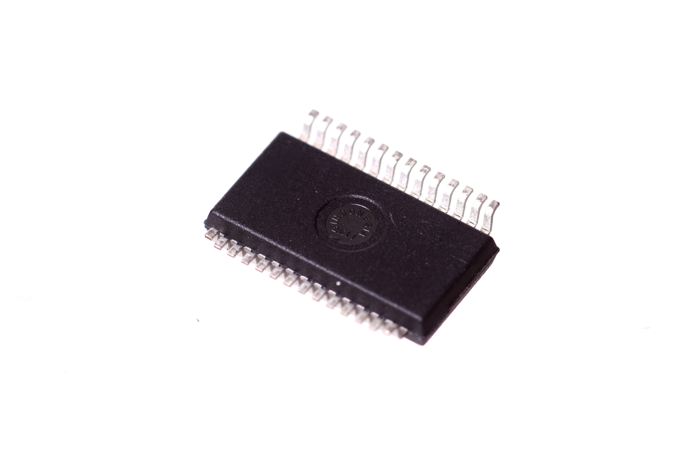

Contents
========

* [ICIC-SS28-X-K232-01>28 Pin SMD (SSOP) FTDI USB-Serial](#icic-ss28-x-k232-0128-pin-smd-ssop-ftdi-usb-serial)
	* [Images](#images)
	* [Datasheets](#datasheets)
	* [EDA](#eda)
		* [Footprints](#footprints)
		* [Symbols](#symbols)
	* [Tags](#tags)
  
![][im]
# ICIC-SS28-X-K232-01>28 Pin SMD (SSOP) FTDI USB-Serial

- ID: ICIC-SS28-X-K232-01
- Name: ICIC-SS28-X-K232-01

## Images
  
  

|Main|Reference|Bottom|
| :---: | :---: | :---: |
||||

## Datasheets

- Datasheet: [datasheet.pdf](datasheet.pdf)

## EDA

### Footprints
  

|||||
| :---: | :---: | :---: | :---: |

### Symbols

## Tags

- index: 325
- index: 4323
- oompID: ICIC-SS28-X-K232-01
- name: 28 Pin SMD (SSOP) FTDI USB-Serial
- hexID: IC232
- oompSort: FTDI USB-Serial
- oompType: ICIC
- oompSize: SS28
- oompColor: X
- oompDesc: K232
- oompIndex: 01
- oompVersion: 99
- ooSEEEDsku: 1720010P1
- ooSEEEDdesc: IC USB FS SERIAL UART
- ooSEEED3dModel: http://www.seeedstudio.com/wiki/File:SSOP28.zip
- oompClass: Surface Mount
- oompClassCode: SMDS
- ooDesignator: U1

[im]: image_600.jpg
