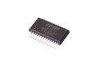

Contents
========

* [IC232 > 28 Pin SMD (SSOP) FTDI USB-Serial](#ic232--28-pin-smd-ssop-ftdi-usb-serial)
	* [Datasheets](#datasheets)
	* [Labels](#labels)
	* [EDA](#eda)
	* [Images](#images)
	* [Tags](#tags)
  
![][im]
# IC232 > 28 Pin SMD (SSOP) FTDI USB-Serial

- ID: ICIC-SS28-X-K232-01
- Hex ID: IC232
- Name: 28 Pin SMD (SSOP) FTDI USB-Serial
- Description: 28 Pin SMD (SSOP) FTDI USB-Serial
- Long Link: [http://oom.lt/ICIC-SS28-X-K232-01](http://oom.lt/ICIC-SS28-X-K232-01)
- Short Link: [http://oom.lt/IC232](http://oom.lt/IC232)

## Datasheets

- Datasheet: [datasheet.pdf](datasheet.pdf)

## Labels
  
  

|label-front|label-inventory|label-spec|
| :---: | :---: | :---: |
||||

## EDA

## Images
  
  

|image|image_RE|image_BOTTOM|label-front|label-inventory|label-spec|
| :---: | :---: | :---: | :---: | :---: | :---: |
|||||||

## Tags

- oompID: ICIC-SS28-X-K232-01
- name: 28 Pin SMD (SSOP) FTDI USB-Serial
- hexID: IC232
- oompSort: FTDI USB-Serial
- oompType: ICIC
- oompSize: SS28
- oompColor: X
- oompDesc: K232
- oompIndex: 01
- oompVersion: 99
- ooSEEEDsku: 1720010P1
- ooSEEEDdesc: IC USB FS SERIAL UART
- ooSEEED3dModel: http://www.seeedstudio.com/wiki/File:SSOP28.zip
- oompClass: Surface Mount
- oompClassCode: SMDS
- ooDesignator: U1

[im]: image_450.jpg
