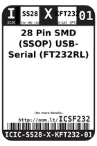
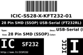
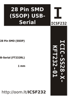

Contents
========

* [ICSF232 > 28 Pin SMD (SSOP) USB-Serial (FT232RL)](#icsf232--28-pin-smd-ssop-usb-serial-ft232rl)
	* [Datasheets](#datasheets)
	* [Labels](#labels)
	* [EDA](#eda)
	* [Images](#images)
	* [Tags](#tags)

# ICSF232 > 28 Pin SMD (SSOP) USB-Serial (FT232RL)

- ID: ICIC-SS28-X-KFT232-01
- Hex ID: ICSF232
- Name: 28 Pin SMD (SSOP) USB-Serial (FT232RL)
- Description: 28 Pin SMD (SSOP) USB-Serial (FT232RL)
- Long Link: [http://oom.lt/ICIC-SS28-X-KFT232-01](http://oom.lt/ICIC-SS28-X-KFT232-01)
- Long Link: [http://oom.lt/ICSF232](http://oom.lt/ICSF232)

## Datasheets

- Datasheet: [datasheet.pdf](datasheet.pdf)

## Labels
  
  

|label-front|label-inventory|label-spec|
| :---: | :---: | :---: |
||||

## EDA

### Symbols

## Images
  
  

|label-front|label-inventory|label-spec|
| :---: | :---: | :---: |
||||

## Tags

- oompID: ICIC-SS28-X-KFT232-01
- name: 28 Pin SMD (SSOP) USB-Serial (FT232RL)
- hexID: ICSF232
- oompSort: ICICSS28KFT232
- oompType: ICIC
- oompSize: SS28
- oompColor: X
- oompDesc: KFT232
- oompIndex: 01
- oompVersion: 98
- ooNumPins: 28
- ooDesignator: U1
