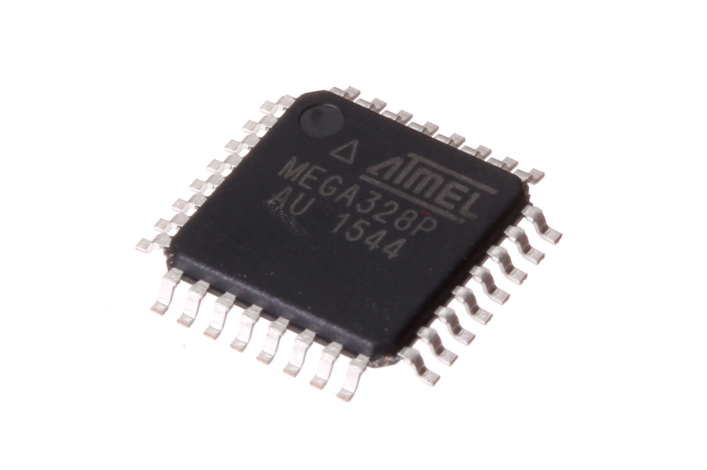
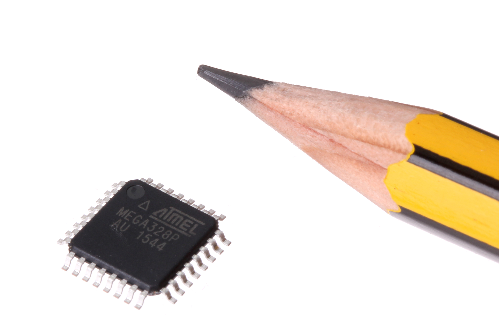
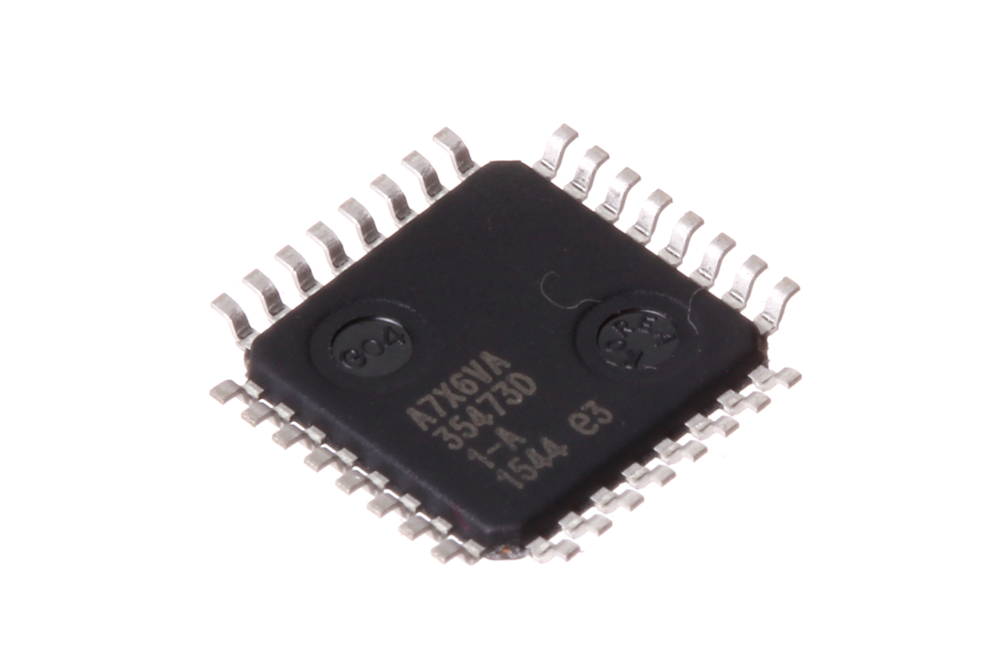

Contents
========

* [ICIC-TQ32-X-K328-01>32 Pin SMD (TQFP) AtMega328P](#icic-tq32-x-k328-0132-pin-smd-tqfp-atmega328p)
	* [Images](#images)
	* [Datasheets](#datasheets)
	* [EDA](#eda)
		* [Footprints](#footprints)
		* [Symbols](#symbols)
	* [Tags](#tags)
  
![][im]
# ICIC-TQ32-X-K328-01>32 Pin SMD (TQFP) AtMega328P

- ID: ICIC-TQ32-X-K328-01
- Name: ICIC-TQ32-X-K328-01

## Images
  
  

|Main|Reference|Bottom|
| :---: | :---: | :---: |
||||

## Datasheets

- Datasheet: [datasheet.pdf](datasheet.pdf)

## EDA

### Footprints
  

|||||
| :---: | :---: | :---: | :---: |

### Symbols

## Tags

- index: 327
- index: 4326
- oompID: ICIC-TQ32-X-K328-01
- name: 32 Pin SMD (TQFP) AtMega328P
- hexID: ICS328
- oompSort: AtMega 328 SMD
- oompType: ICIC
- oompSize: TQ32
- oompColor: X
- oompDesc: K328
- oompIndex: 01
- oompVersion: 99
- ooManufacturer: C-ATME
- ooManufacturerPartNumber: ATMEGA328P-AU
- ooSEEEDsku: 1030060P1
- ooSEEEDdesc: IC MCU 8BIT 32KB FLASH 32TQFP
- ooSEEED3dModel: http://www.seeedstudio.com/wiki/File:TQFP32.zip
- oompClass: Surface Mount
- oompClassCode: SMDS
- ooPitch: 0.65 mm
- ooPadWidth: 1 mm
- ooPadHeight: 0.32 mm
- ooPin1: PD3
- ooPin2: PD4
- ooPin3: GND
- ooPin4: VCC
- ooPin5: GND
- ooPin6: VCC
- ooPin7: PB6
- ooPin8: PB7
- ooPin9: PD5
- ooPin10: PD6
- ooPin11: PD7
- ooPin12: PB0
- ooPin13: PB1
- ooPin14: PB2
- ooPin15: PB3
- ooPin16: PB4
- ooPin17: PB5
- ooPin18: AVCC
- ooPin19: ADC6
- ooPin20: AREF
- ooPin21: GND
- ooPin22: ADC7
- ooPin23: PC0
- ooPin24: PC1
- ooPin25: PC2
- ooPin26: PC3
- ooPin27: PC4
- ooPin28: PC5
- ooPin29: PC5
- ooPin30: PD0
- ooPin31: PD1
- ooPin32: PD2
- ooNumPins: 32
- oompDiag: template;ICIC-TQ32-X-XXXX-01-diag
- oompSymbol: twoSidedPackage;##ooNumPins@@
- oompFootprint: TQSMDPackage;##ooNumPins@@;##ooPitch@@;##ooPadWidth@@;##ooPadHeight@@
- ooPackageMarking: ATMEGA328
- ooDesignator: U1

[im]: image_600.jpg
