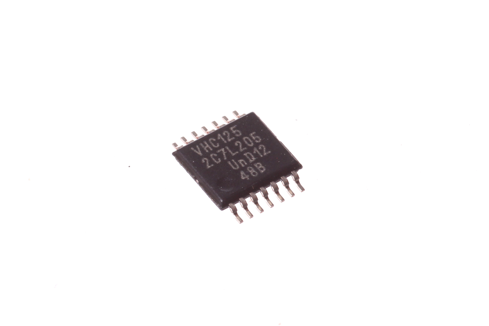
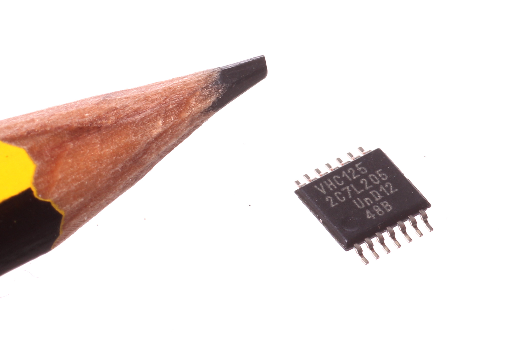
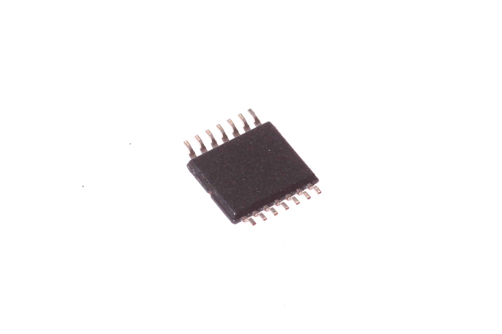

Contents
========

* [ICIC-TS14-X-K125-01>14 Pin SMD (TSSOP) Quad Buffer (74HC125)](#icic-ts14-x-k125-0114-pin-smd-tssop-quad-buffer-74hc125)
	* [Images](#images)
	* [Datasheets](#datasheets)
	* [EDA](#eda)
		* [Symbols](#symbols)
	* [Tags](#tags)
  
![][im]
# ICIC-TS14-X-K125-01>14 Pin SMD (TSSOP) Quad Buffer (74HC125)

- ID: ICIC-TS14-X-K125-01
- Name: ICIC-TS14-X-K125-01

## Images
  
  

|Main|Reference|Bottom|
| :---: | :---: | :---: |
||||

## Datasheets

- Datasheet: [datasheet.pdf](datasheet.pdf)

## EDA

### Symbols

## Tags

- index: 328
- index: 4327
- oompID: ICIC-TS14-X-K125-01
- name: 14 Pin SMD (TSSOP) Quad Buffer (74HC125)
- hexID: ICQB
- oompSort: Quad Buffer
- oompType: ICIC
- oompSize: TS14
- oompColor: X
- oompDesc: K125
- oompIndex: 01
- oompVersion: 99
- ooSEEEDsku: 1050030P1
- ooSEEEDdesc: IC BUFFER/LINE DVR QUAD 14TSSOP
- ooSEEED3dModel: http://www.seeedstudio.com/wiki/File:TSSOP14.zip
- oompClass: Surface Mount
- oompClassCode: SMDS
- ooDesignator: U1

[im]: image_600.jpg
