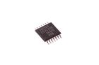

Contents
========

* [ICQB > 14 Pin SMD (TSSOP) Quad Buffer (74HC125)](#icqb--14-pin-smd-tssop-quad-buffer-74hc125)
	* [Datasheets](#datasheets)
	* [Labels](#labels)
	* [EDA](#eda)
	* [Images](#images)
	* [Tags](#tags)
  
![][im]
# ICQB > 14 Pin SMD (TSSOP) Quad Buffer (74HC125)

- ID: ICIC-TS14-X-K125-01
- Hex ID: ICQB
- Name: 14 Pin SMD (TSSOP) Quad Buffer (74HC125)
- Description: 14 Pin SMD (TSSOP) Quad Buffer (74HC125)
- Long Link: [http://oom.lt/ICIC-TS14-X-K125-01](http://oom.lt/ICIC-TS14-X-K125-01)
- Long Link: [http://oom.lt/ICQB](http://oom.lt/ICQB)

## Datasheets

- Datasheet: [datasheet.pdf](datasheet.pdf)

## Labels
  
  

|label-front|label-inventory|label-spec|
| :---: | :---: | :---: |
||||

## EDA

### Symbols

## Images
  
  

|image|image_RE|image_BOTTOM|label-front|label-inventory|label-spec|
| :---: | :---: | :---: | :---: | :---: | :---: |
|||||||

## Tags

- oompID: ICIC-TS14-X-K125-01
- name: 14 Pin SMD (TSSOP) Quad Buffer (74HC125)
- hexID: ICQB
- oompSort: Quad Buffer
- oompType: ICIC
- oompSize: TS14
- oompColor: X
- oompDesc: K125
- oompIndex: 01
- oompVersion: 99
- ooSEEEDsku: 1050030P1
- ooSEEEDdesc: IC BUFFER/LINE DVR QUAD 14TSSOP
- ooSEEED3dModel: http://www.seeedstudio.com/wiki/File:TSSOP14.zip
- oompClass: Surface Mount
- oompClassCode: SMDS
- ooDesignator: U1

[im]: image_450.jpg
