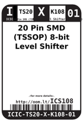
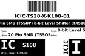
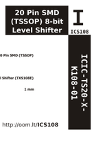

Contents
========

* [ICS108 > 20 Pin SMD (TSSOP) 8-bit Level Shifter (TXS108E)](#ics108--20-pin-smd-tssop-8-bit-level-shifter-txs108e)
	* [Images](#images)
	* [Datasheets](#datasheets)
	* [Labels](#labels)
	* [EDA](#eda)
	* [Tags](#tags)

# ICS108 > 20 Pin SMD (TSSOP) 8-bit Level Shifter (TXS108E)

- ID: ICIC-TS20-X-K108-01
- Hex ID: ICS108
- Name: 20 Pin SMD (TSSOP) 8-bit Level Shifter (TXS108E)
- Description: 20 Pin SMD (TSSOP) 8-bit Level Shifter (TXS108E)

## Images
  
  

|label-front|label-inventory|label-spec|
| :---: | :---: | :---: |
||||

## Datasheets

- Datasheet: [datasheet.pdf](datasheet.pdf)

## Labels
  
  

|label-front|label-inventory|label-spec|
| :---: | :---: | :---: |
||||

## EDA

### Symbols

## Tags

- oompID: ICIC-TS20-X-K108-01
- name: 20 Pin SMD (TSSOP) 8-bit Level Shifter (TXS108E)
- hexID: ICS108
- oompSort: ICICTS20K108
- oompType: ICIC
- oompSize: TS20
- oompColor: X
- oompDesc: K108
- oompIndex: 01
- oompVersion: 98
- ooDesignator: U1
