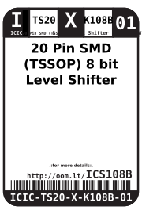
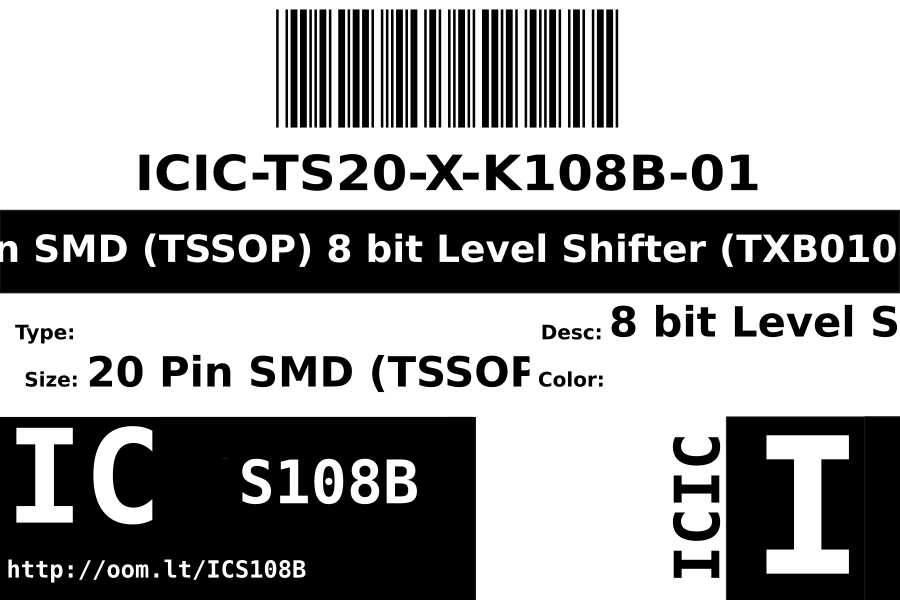
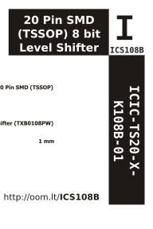

Contents
========

* [ICIC-TS20-X-K108B-01>20 Pin SMD (TSSOP) 8 bit Level Shifter (TXB0108PW)](#icic-ts20-x-k108b-0120-pin-smd-tssop-8-bit-level-shifter-txb0108pw)
	* [Datasheets](#datasheets)
	* [Labels](#labels)
	* [EDA](#eda)
		* [Symbols](#symbols)
	* [Tags](#tags)

# ICIC-TS20-X-K108B-01>20 Pin SMD (TSSOP) 8 bit Level Shifter (TXB0108PW)

- ID: ICIC-TS20-X-K108B-01
- Name: ICIC-TS20-X-K108B-01

## Datasheets

- Datasheet: [datasheet.pdf](datasheet.pdf)

## Labels
  
  

|Front|Inventory|Specifications|
| :---: | :---: | :---: |
||||

## EDA

### Symbols

## Tags

- oompID: ICIC-TS20-X-K108B-01
- name: 20 Pin SMD (TSSOP) 8 bit Level Shifter (TXB0108PW)
- hexID: ICS108B
- oompSort: ICICTS20K108B
- oompType: ICIC
- oompSize: TS20
- oompColor: X
- oompDesc: K108B
- oompIndex: 01
- oompVersion: 98
- ooNumPins: 20
- ooDesignator: U
