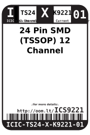
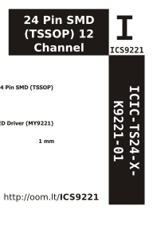

Contents
========

* [ICIC-TS24-X-K9221-01>24 Pin SMD (TSSOP) 12 Channel Constant Current LED Driver (MY9221)](#icic-ts24-x-k9221-0124-pin-smd-tssop-12-channel-constant-current-led-driver-my9221)
	* [Datasheets](#datasheets)
	* [Labels](#labels)
	* [EDA](#eda)
		* [Symbols](#symbols)
	* [Tags](#tags)

# ICIC-TS24-X-K9221-01>24 Pin SMD (TSSOP) 12 Channel Constant Current LED Driver (MY9221)

- ID: ICIC-TS24-X-K9221-01
- Name: ICIC-TS24-X-K9221-01

## Datasheets

- Datasheet: [datasheet.pdf](datasheet.pdf)

## Labels
  
  

|Front|Inventory|Specifications|
| :---: | :---: | :---: |
||||

## EDA

### Symbols

## Tags

- index: 12630
- oompID: ICIC-TS24-X-K9221-01
- name: 24 Pin SMD (TSSOP) 12 Channel Constant Current LED Driver (MY9221)
- hexID: ICS9221
- oompSort: ICICTS24K9221
- oompType: ICIC
- oompSize: TS24
- oompColor: X
- oompDesc: K9221
- oompIndex: 01
- oompVersion: 98
- ooNumPins: 24
- ooDesignator: U
