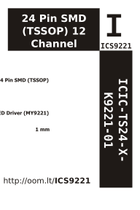

Contents
========

* [ICS9221 > 24 Pin SMD (TSSOP) 12 Channel Constant Current LED Driver (MY9221)](#ics9221--24-pin-smd-tssop-12-channel-constant-current-led-driver-my9221)
	* [Datasheets](#datasheets)
	* [Labels](#labels)
	* [EDA](#eda)
	* [Images](#images)
	* [Tags](#tags)

# ICS9221 > 24 Pin SMD (TSSOP) 12 Channel Constant Current LED Driver (MY9221)

- ID: ICIC-TS24-X-K9221-01
- Hex ID: ICS9221
- Name: 24 Pin SMD (TSSOP) 12 Channel Constant Current LED Driver (MY9221)
- Description: 24 Pin SMD (TSSOP) 12 Channel Constant Current LED Driver (MY9221)
- Long Link: [http://oom.lt/ICIC-TS24-X-K9221-01](http://oom.lt/ICIC-TS24-X-K9221-01)
- Long Link: [http://oom.lt/ICS9221](http://oom.lt/ICS9221)

## Datasheets

- Datasheet: [datasheet.pdf](datasheet.pdf)

## Labels
  
  

|label-front|label-inventory|label-spec|
| :---: | :---: | :---: |
||||

## EDA

### Symbols

## Images
  
  

|label-front|label-inventory|label-spec|
| :---: | :---: | :---: |
||||

## Tags

- oompID: ICIC-TS24-X-K9221-01
- name: 24 Pin SMD (TSSOP) 12 Channel Constant Current LED Driver (MY9221)
- hexID: ICS9221
- oompSort: ICICTS24K9221
- oompType: ICIC
- oompSize: TS24
- oompColor: X
- oompDesc: K9221
- oompIndex: 01
- oompVersion: 98
- ooNumPins: 24
- ooDesignator: U
