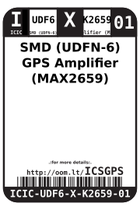
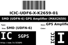

Contents
========

* [ICSGPS > SMD (UDFN-6) GPS Amplifier (MAX2659)](#icsgps--smd-udfn-6-gps-amplifier-max2659)
	* [Datasheets](#datasheets)
	* [Labels](#labels)
	* [EDA](#eda)
	* [Images](#images)
	* [Tags](#tags)

# ICSGPS > SMD (UDFN-6) GPS Amplifier (MAX2659)

- ID: ICIC-UDF6-X-K2659-01
- Hex ID: ICSGPS
- Name: SMD (UDFN-6) GPS Amplifier (MAX2659)
- Description: SMD (UDFN-6) GPS Amplifier (MAX2659)
- Long Link: [http://oom.lt/ICIC-UDF6-X-K2659-01](http://oom.lt/ICIC-UDF6-X-K2659-01)
- Short Link: [http://oom.lt/ICSGPS](http://oom.lt/ICSGPS)

## Datasheets

- Datasheet: [datasheet.pdf](datasheet.pdf)

## Labels
  
  

|label-front|label-inventory|label-spec|
| :---: | :---: | :---: |
||||

## EDA

## Images
  
  

|label-front|label-inventory|label-spec|
| :---: | :---: | :---: |
||||

## Tags

- oompID: ICIC-UDF6-X-K2659-01
- name: SMD (UDFN-6) GPS Amplifier (MAX2659)
- hexID: ICSGPS
- oompSort: ICICUDF6K2659
- oompType: ICIC
- oompSize: UDF6
- oompColor: X
- oompDesc: K2659
- oompIndex: 01
- oompVersion: 98
- ooWidth: 1.0 mm
- ooLength: 1.5 mm
- ooNumPins: 6
- ooDesignator: U
