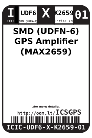
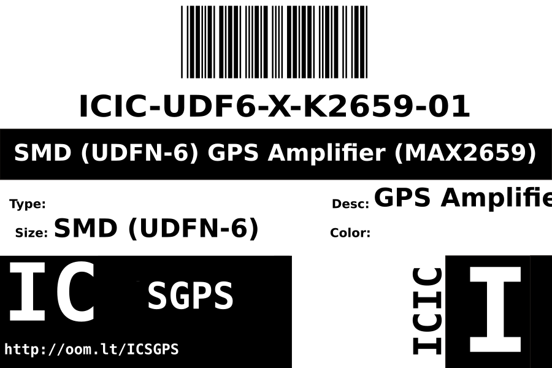
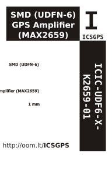

Contents
========

* [ICIC-UDF6-X-K2659-01>SMD (UDFN-6) GPS Amplifier (MAX2659)](#icic-udf6-x-k2659-01smd-udfn-6-gps-amplifier-max2659)
	* [Datasheets](#datasheets)
	* [Labels](#labels)
	* [EDA](#eda)
		* [Symbols](#symbols)
	* [Tags](#tags)

# ICIC-UDF6-X-K2659-01>SMD (UDFN-6) GPS Amplifier (MAX2659)

- ID: ICIC-UDF6-X-K2659-01
- Name: ICIC-UDF6-X-K2659-01

## Datasheets

- Datasheet: [datasheet.pdf](datasheet.pdf)

## Labels
  
  

|Front|Inventory|Specifications|
| :---: | :---: | :---: |
||||

## EDA

### Symbols

## Tags

- hexID: ICSGPS
- oompSort: ICICUDF6K2659
- oompType: ICIC
- oompSize: UDF6
- oompColor: X
- oompDesc: K2659
- oompIndex: 01
- oompVersion: 98
- ooWidth: 1.0 mm
- ooLength: 1.5 mm
- ooNumPins: 6
- ooDesignator: U
