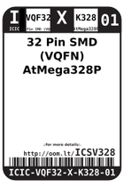
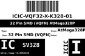
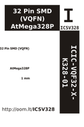

Contents
========

* [ICSV328 > 32 Pin SMD (VQFN) AtMega328P](#icsv328--32-pin-smd-vqfn-atmega328p)
	* [Datasheets](#datasheets)
	* [Labels](#labels)
	* [EDA](#eda)
	* [Images](#images)
	* [Tags](#tags)

# ICSV328 > 32 Pin SMD (VQFN) AtMega328P

- ID: ICIC-VQF32-X-K328-01
- Hex ID: ICSV328
- Name: 32 Pin SMD (VQFN) AtMega328P
- Description: 32 Pin SMD (VQFN) AtMega328P
- Long Link: [http://oom.lt/ICIC-VQF32-X-K328-01](http://oom.lt/ICIC-VQF32-X-K328-01)
- Short Link: [http://oom.lt/ICSV328](http://oom.lt/ICSV328)

## Datasheets

- Datasheet: [datasheet.pdf](datasheet.pdf)

## Labels
  
  

|label-front|label-inventory|label-spec|
| :---: | :---: | :---: |
||||

## EDA

### Symbols

## Images
  
  

|label-front|label-inventory|label-spec|
| :---: | :---: | :---: |
||||

## Tags

- oompID: ICIC-VQF32-X-K328-01
- name: 32 Pin SMD (VQFN) AtMega328P
- hexID: ICSV328
- oompSort: ICICVQF32K328
- oompType: ICIC
- oompSize: VQF32
- oompColor: X
- oompDesc: K328
- oompIndex: 01
- oompVersion: 98
- ooNumPins: 32
- ooDesignator: U
