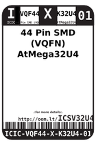
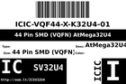
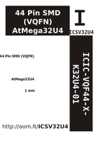

Contents
========

* [ICSV32U4 > 44 Pin SMD (VQFN) AtMega32U4](#icsv32u4--44-pin-smd-vqfn-atmega32u4)
	* [Datasheets](#datasheets)
	* [Labels](#labels)
	* [EDA](#eda)
	* [Images](#images)
	* [Tags](#tags)

# ICSV32U4 > 44 Pin SMD (VQFN) AtMega32U4

- ID: ICIC-VQF44-X-K32U4-01
- Hex ID: ICSV32U4
- Name: 44 Pin SMD (VQFN) AtMega32U4
- Description: 44 Pin SMD (VQFN) AtMega32U4
- Long Link: [http://oom.lt/ICIC-VQF44-X-K32U4-01](http://oom.lt/ICIC-VQF44-X-K32U4-01)
- Long Link: [http://oom.lt/ICSV32U4](http://oom.lt/ICSV32U4)

## Datasheets

- Datasheet: [datasheet.pdf](datasheet.pdf)

## Labels
  
  

|label-front|label-inventory|label-spec|
| :---: | :---: | :---: |
||||

## EDA

### Symbols

## Images
  
  

|label-front|label-inventory|label-spec|
| :---: | :---: | :---: |
||||

## Tags

- oompID: ICIC-VQF44-X-K32U4-01
- name: 44 Pin SMD (VQFN) AtMega32U4
- hexID: ICSV32U4
- oompSort: ICICVQF44K32U4
- oompType: ICIC
- oompSize: VQF44
- oompColor: X
- oompDesc: K32U4
- oompIndex: 01
- oompVersion: 98
- ooDesignator: U1
