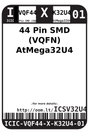
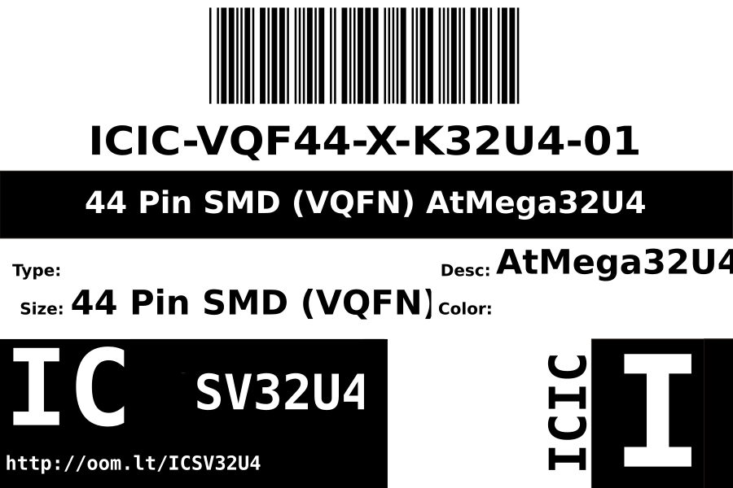
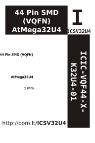

Contents
========

* [ICIC-VQF44-X-K32U4-01>44 Pin SMD (VQFN) AtMega32U4](#icic-vqf44-x-k32u4-0144-pin-smd-vqfn-atmega32u4)
	* [Datasheets](#datasheets)
	* [Labels](#labels)
	* [EDA](#eda)
		* [Symbols](#symbols)
	* [Tags](#tags)

# ICIC-VQF44-X-K32U4-01>44 Pin SMD (VQFN) AtMega32U4

- ID: ICIC-VQF44-X-K32U4-01
- Name: ICIC-VQF44-X-K32U4-01

## Datasheets

- Datasheet: [datasheet.pdf](datasheet.pdf)

## Labels
  
  

|label-front|label-inventory|label-spec|
| :---: | :---: | :---: |
||||

## EDA

### Symbols

## Tags

- oompID: ICIC-VQF44-X-K32U4-01
- name: 44 Pin SMD (VQFN) AtMega32U4
- hexID: ICSV32U4
- oompSort: ICICVQF44K32U4
- oompType: ICIC
- oompSize: VQF44
- oompColor: X
- oompDesc: K32U4
- oompIndex: 01
- oompVersion: 98
- ooDesignator: U1
