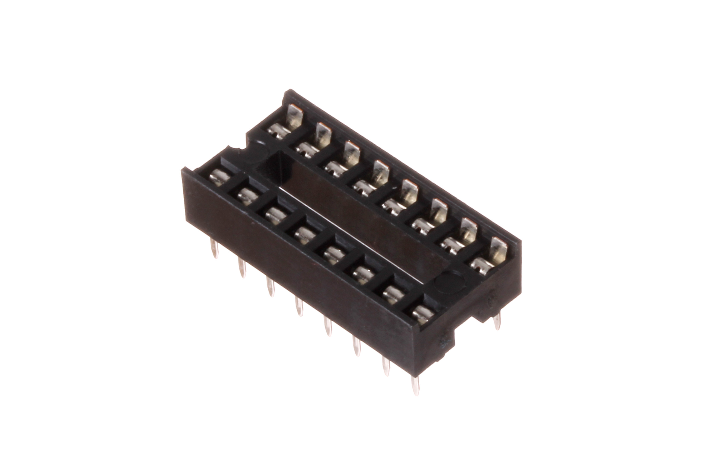
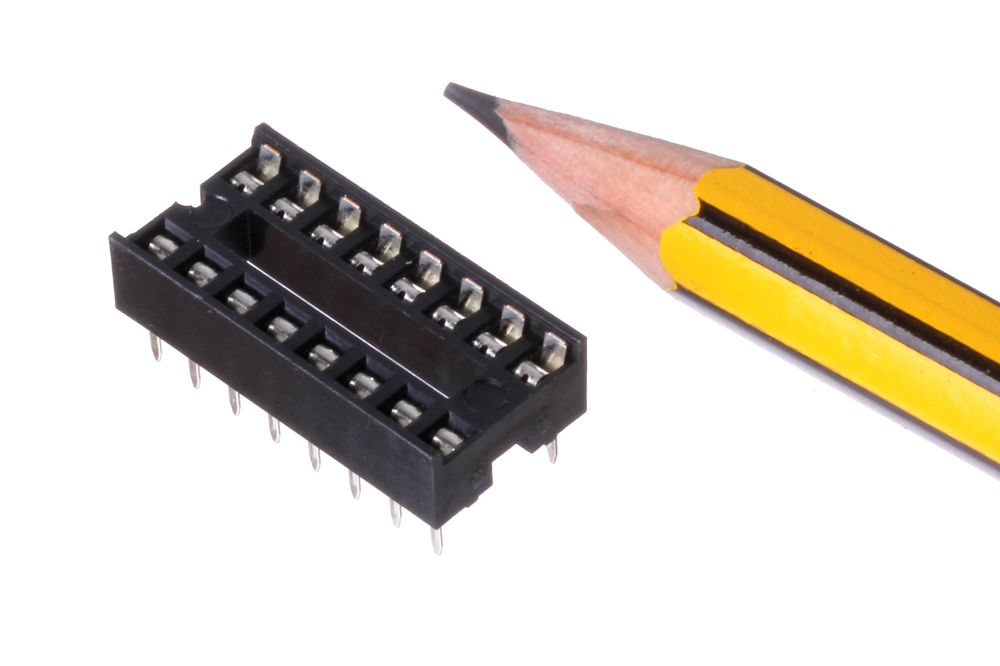
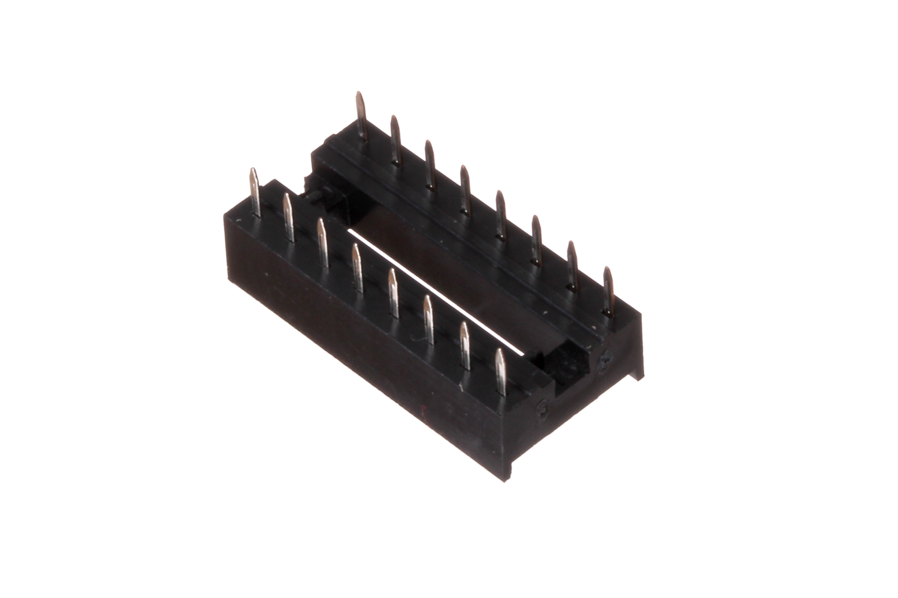

Contents
========

* [ICSO-DI16-X-STAN-01>16 Pin DIP IC Socket](#icso-di16-x-stan-0116-pin-dip-ic-socket)
	* [Images](#images)
	* [Datasheets](#datasheets)
	* [EDA](#eda)
		* [Footprints](#footprints)
		* [Symbols](#symbols)
	* [Tags](#tags)

# ICSO-DI16-X-STAN-01>16 Pin DIP IC Socket

- ID: ICSO-DI16-X-STAN-01
- Name: ICSO-DI16-X-STAN-01

## Images
  
  

|Main|Reference|Bottom|
| :---: | :---: | :---: |
||||

## Datasheets

- Datasheet: [datasheet.pdf](datasheet.pdf)

## EDA

### Footprints
  

|||||
| :---: | :---: | :---: | :---: |

### Symbols

## Tags

- index: 335
- oompID: ICSO-DI16-X-STAN-01
- name: 16 Pin DIP IC Socket
- hexID: IS16
- oompSort: 
- oompClass: Through Hole
- oompClassCode: THTH
- oompType: ICSO
- oompSize: DI16
- oompColor: X
- oompDesc: STAN
- oompIndex: 01
- oompVersion: 40
- ooDesignator: U1
