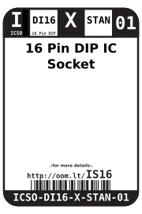
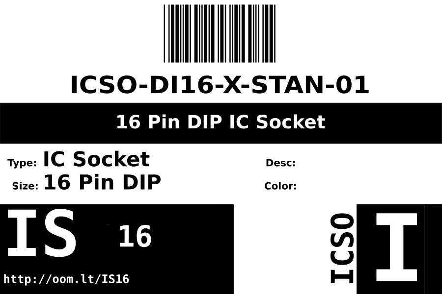

Contents
========

* [ICSO-DI16-X-STAN-01>16 Pin DIP IC Socket](#icso-di16-x-stan-0116-pin-dip-ic-socket)
	* [Images](#images)
	* [Datasheets](#datasheets)
	* [Labels](#labels)
	* [EDA](#eda)
		* [Symbols](#symbols)
	* [Tags](#tags)
  
![][im]
# ICSO-DI16-X-STAN-01>16 Pin DIP IC Socket

- ID: ICSO-DI16-X-STAN-01
- Name: ICSO-DI16-X-STAN-01

## Images
  
  

|image|image_RE|image_BOTTOM|
| :---: | :---: | :---: |
||||

## Datasheets

- Datasheet: [datasheet.pdf](datasheet.pdf)

## Labels
  
  

|label-front|label-inventory|label-spec|
| :---: | :---: | :---: |
||||

## EDA

### Symbols

## Tags

- oompID: ICSO-DI16-X-STAN-01
- name: 16 Pin DIP IC Socket
- hexID: IS16
- oompSort: 
- oompClass: Through Hole
- oompClassCode: THTH
- oompType: ICSO
- oompSize: DI16
- oompColor: X
- oompDesc: STAN
- oompIndex: 01
- oompVersion: 40
- ooDesignator: U1

[im]: image_600.jpg
