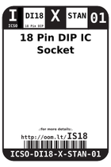

Contents
========

* [IS18 > 18 Pin DIP IC Socket](#is18--18-pin-dip-ic-socket)
	* [Datasheets](#datasheets)
	* [Labels](#labels)
	* [EDA](#eda)
	* [Images](#images)
	* [Tags](#tags)

# IS18 > 18 Pin DIP IC Socket

- ID: ICSO-DI18-X-STAN-01
- Hex ID: IS18
- Name: 18 Pin DIP IC Socket
- Description: 18 Pin DIP IC Socket
- Long Link: [http://oom.lt/ICSO-DI18-X-STAN-01](http://oom.lt/ICSO-DI18-X-STAN-01)
- Long Link: [http://oom.lt/IS18](http://oom.lt/IS18)

## Datasheets

- Datasheet: [datasheet.pdf](datasheet.pdf)

## Labels
  
  

|label-front|label-inventory|label-spec|
| :---: | :---: | :---: |
||||

## EDA

### Symbols

## Images
  
  

|label-front|label-inventory|label-spec|
| :---: | :---: | :---: |
||||

## Tags

- oompID: ICSO-DI18-X-STAN-01
- name: 18 Pin DIP IC Socket
- hexID: IS18
- oompSort: 
- oompClass: Through Hole
- oompClassCode: THTH
- oompType: ICSO
- oompSize: DI18
- oompColor: X
- oompDesc: STAN
- oompIndex: 01
- oompVersion: 40
- ooDesignator: U1
