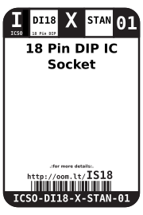
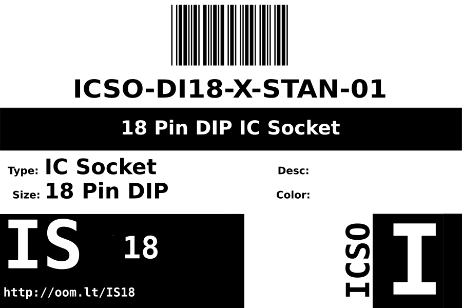
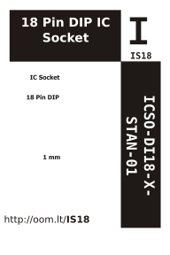

Contents
========

* [ICSO-DI18-X-STAN-01>18 Pin DIP IC Socket](#icso-di18-x-stan-0118-pin-dip-ic-socket)
	* [Datasheets](#datasheets)
	* [Labels](#labels)
	* [EDA](#eda)
		* [Symbols](#symbols)
	* [Tags](#tags)

# ICSO-DI18-X-STAN-01>18 Pin DIP IC Socket

- ID: ICSO-DI18-X-STAN-01
- Name: ICSO-DI18-X-STAN-01

## Datasheets

- Datasheet: [datasheet.pdf](datasheet.pdf)

## Labels
  
  

|Front|Inventory|Specifications|
| :---: | :---: | :---: |
||||

## EDA

### Symbols

## Tags

- index: 336
- oompID: ICSO-DI18-X-STAN-01
- name: 18 Pin DIP IC Socket
- hexID: IS18
- oompSort: 
- oompClass: Through Hole
- oompClassCode: THTH
- oompType: ICSO
- oompSize: DI18
- oompColor: X
- oompDesc: STAN
- oompIndex: 01
- oompVersion: 40
- ooDesignator: U1
