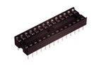
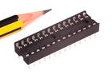
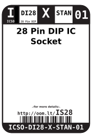
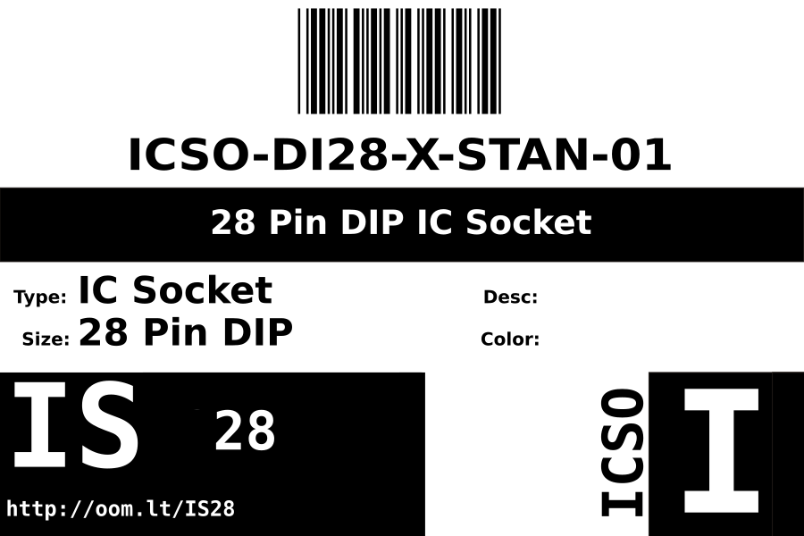

Contents
========

* [ICSO-DI28-X-STAN-01>28 Pin DIP IC Socket](#icso-di28-x-stan-0128-pin-dip-ic-socket)
	* [Images](#images)
	* [Datasheets](#datasheets)
	* [Labels](#labels)
	* [EDA](#eda)
		* [Symbols](#symbols)
	* [Tags](#tags)
  
![][im]
# ICSO-DI28-X-STAN-01>28 Pin DIP IC Socket

- ID: ICSO-DI28-X-STAN-01
- Name: ICSO-DI28-X-STAN-01

## Images
  
  

|image|image_RE|image_BOTTOM|
| :---: | :---: | :---: |
||||

## Datasheets

- Datasheet: [datasheet.pdf](datasheet.pdf)

## Labels
  
  

|label-front|label-inventory|label-spec|
| :---: | :---: | :---: |
||||

## EDA

### Symbols

## Tags

- oompID: ICSO-DI28-X-STAN-01
- name: 28 Pin DIP IC Socket
- hexID: IS28
- oompSort: 0101028
- oompType: ICSO
- oompSize: DI28
- oompColor: X
- oompDesc: STAN
- oompIndex: 01
- oompVersion: 99
- ooPitch: 2.54 mm
- ooWidth: 10.16 mm
- ooHeight: 5.2 mm
- ooLength: 35.56 mm
- ooNumPins: 28
- ooMaxCurrent: 1 A
- ooMaxVoltage: 250 V
- oompClass: Through Hole Component
- oompClassCode: THTH
- ooDesignator: U1

[im]: image_600.jpg
