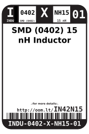
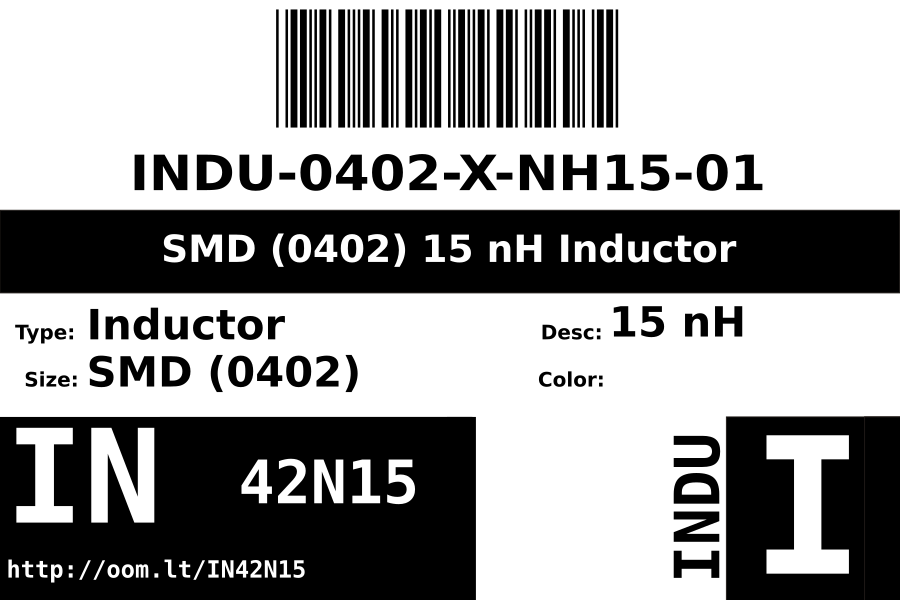

Contents
========

* [INDU-0402-X-NH15-01>SMD (0402) 15 nH Inductor](#indu-0402-x-nh15-01smd-0402-15-nh-inductor)
	* [Datasheets](#datasheets)
	* [Labels](#labels)
	* [EDA](#eda)
		* [Symbols](#symbols)
	* [Tags](#tags)

# INDU-0402-X-NH15-01>SMD (0402) 15 nH Inductor

- ID: INDU-0402-X-NH15-01
- Name: INDU-0402-X-NH15-01

## Datasheets

- Datasheet: [datasheet.pdf](datasheet.pdf)

## Labels
  
  

|Front|Inventory|Specifications|
| :---: | :---: | :---: |
||||

## EDA

### Symbols

## Tags

- index: 12637
- oompID: INDU-0402-X-NH15-01
- name: SMD (0402) 15 nH Inductor
- hexID: IN42N15
- oompSort: INDU0402NH15
- oompType: INDU
- oompSize: 0402
- oompColor: X
- oompDesc: NH15
- oompIndex: 01
- oompVersion: 98
- ooWidth: 0.5 mm
- ooLength: 1.0 mm
- ooNumPins: 2
- ooDesignator: L1
