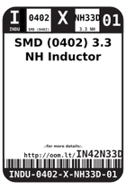
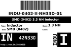

Contents
========

* [IN42N33D > SMD (0402) 3.3 NH Inductor](#in42n33d--smd-0402-33-nh-inductor)
	* [Datasheets](#datasheets)
	* [Labels](#labels)
	* [EDA](#eda)
	* [Images](#images)
	* [Tags](#tags)

# IN42N33D > SMD (0402) 3.3 NH Inductor

- ID: INDU-0402-X-NH33D-01
- Hex ID: IN42N33D
- Name: SMD (0402) 3.3 NH Inductor
- Description: SMD (0402) 3.3 NH Inductor
- Long Link: [http://oom.lt/INDU-0402-X-NH33D-01](http://oom.lt/INDU-0402-X-NH33D-01)
- Short Link: [http://oom.lt/IN42N33D](http://oom.lt/IN42N33D)

## Datasheets

- Datasheet: [datasheet.pdf](datasheet.pdf)

## Labels
  
  

|label-front|label-inventory|label-spec|
| :---: | :---: | :---: |
||||

## EDA

### Symbols

## Images
  
  

|label-front|label-inventory|label-spec|
| :---: | :---: | :---: |
||||

## Tags

- oompID: INDU-0402-X-NH33D-01
- name: SMD (0402) 3.3 NH Inductor
- hexID: IN42N33D
- oompSort: INDU0402NH33D
- oompType: INDU
- oompSize: 0402
- oompColor: X
- oompDesc: NH33D
- oompIndex: 01
- oompVersion: 98
- ooWidth: 0.5 mm
- ooLength: 1.0 mm
- ooNumPins: 2
- ooDesignator: L1
