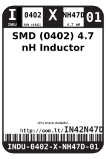
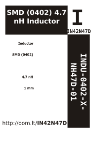

Contents
========

* [INDU-0402-X-NH47D-01>SMD (0402) 4.7 nH Inductor](#indu-0402-x-nh47d-01smd-0402-47-nh-inductor)
	* [Datasheets](#datasheets)
	* [Labels](#labels)
	* [EDA](#eda)
		* [Symbols](#symbols)
	* [Tags](#tags)

# INDU-0402-X-NH47D-01>SMD (0402) 4.7 nH Inductor

- ID: INDU-0402-X-NH47D-01
- Name: INDU-0402-X-NH47D-01

## Datasheets

- Datasheet: [datasheet.pdf](datasheet.pdf)

## Labels
  
  

|label-front|label-inventory|label-spec|
| :---: | :---: | :---: |
||||

## EDA

### Symbols

## Tags

- oompID: INDU-0402-X-NH47D-01
- name: SMD (0402) 4.7 nH Inductor
- hexID: IN42N47D
- oompSort: INDU0402NH47D
- oompType: INDU
- oompSize: 0402
- oompColor: X
- oompDesc: NH47D
- oompIndex: 01
- oompVersion: 98
- ooWidth: 0.5 mm
- ooLength: 1.0 mm
- ooNumPins: 2
- ooDesignator: L1
