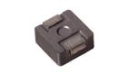

Contents
========

* [INDU-06-X-UH10-01>6 mm 10 uH Inductor](#indu-06-x-uh10-016-mm-10-uh-inductor)
	* [Images](#images)
	* [Datasheets](#datasheets)
	* [Labels](#labels)
	* [EDA](#eda)
		* [Symbols](#symbols)
	* [Tags](#tags)
  
![][im]
# INDU-06-X-UH10-01>6 mm 10 uH Inductor

- ID: INDU-06-X-UH10-01
- Name: INDU-06-X-UH10-01

## Images
  
  

|image|image_RE|image_BOTTOM|
| :---: | :---: | :---: |
||||

## Datasheets

- Datasheet: [datasheet.pdf](datasheet.pdf)

## Labels
  
  

|label-front|label-inventory|label-spec|
| :---: | :---: | :---: |
||||

## EDA

### Symbols

## Tags

- oompID: INDU-06-X-UH10-01
- name: 6 mm 10 uH Inductor
- hexID: IN06U10
- oompSort: 
- oompClass: Surface Mount
- oompClassCode: SMDS
- oompType: INDU
- oompSize: 06
- oompColor: X
- oompDesc: UH10
- oompIndex: 01
- oompVersion: 40
- oompSchem: template;INDU-XXXX-X-XXXX-XX-schem
- ooDesignator: L1

[im]: image_600.jpg
