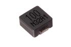

Contents
========

* [IN06U10 > 6 mm 10 uH Inductor](#in06u10--6-mm-10-uh-inductor)
	* [Datasheets](#datasheets)
	* [Labels](#labels)
	* [EDA](#eda)
	* [Images](#images)
	* [Tags](#tags)
  
![][im]
# IN06U10 > 6 mm 10 uH Inductor

- ID: INDU-06-X-UH10-01
- Hex ID: IN06U10
- Name: 6 mm 10 uH Inductor
- Description: 6 mm 10 uH Inductor
- Long Link: [http://oom.lt/INDU-06-X-UH10-01](http://oom.lt/INDU-06-X-UH10-01)
- Short Link: [http://oom.lt/IN06U10](http://oom.lt/IN06U10)

## Datasheets

- Datasheet: [datasheet.pdf](datasheet.pdf)

## Labels
  
  

|label-front|label-inventory|label-spec|
| :---: | :---: | :---: |
||||

## EDA

### Symbols

## Images
  
  

|image|image_RE|image_BOTTOM|label-front|label-inventory|label-spec|
| :---: | :---: | :---: | :---: | :---: | :---: |
|||||||

## Tags

- oompID: INDU-06-X-UH10-01
- name: 6 mm 10 uH Inductor
- hexID: IN06U10
- oompSort: 
- oompClass: Surface Mount
- oompClassCode: SMDS
- oompType: INDU
- oompSize: 06
- oompColor: X
- oompDesc: UH10
- oompIndex: 01
- oompVersion: 40
- oompSchem: template;INDU-XXXX-X-XXXX-XX-schem
- ooDesignator: L1

[im]: image_450.jpg
