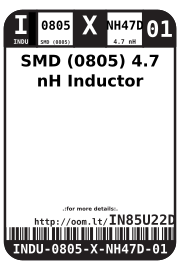
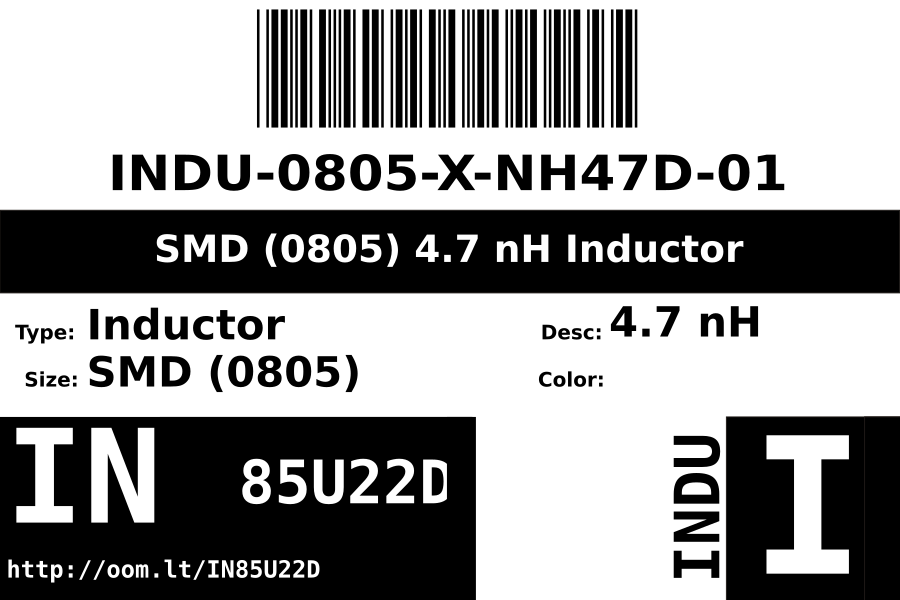
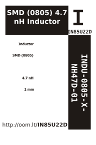

Contents
========

* [INDU-0805-X-NH47D-01>SMD (0805) 4.7 nH Inductor](#indu-0805-x-nh47d-01smd-0805-47-nh-inductor)
	* [Images](#images)
	* [Datasheets](#datasheets)
	* [Labels](#labels)
	* [EDA](#eda)
		* [Symbols](#symbols)
	* [Tags](#tags)
  
![][im]
# INDU-0805-X-NH47D-01>SMD (0805) 4.7 nH Inductor

- ID: INDU-0805-X-NH47D-01
- Name: INDU-0805-X-NH47D-01

## Images
  
  

|image|image_RE|
| :---: | :---: |
|||

## Datasheets

- Datasheet: [datasheet.pdf](datasheet.pdf)

## Labels
  
  

|label-front|label-inventory|label-spec|
| :---: | :---: | :---: |
||||

## EDA

### Symbols

## Tags

- oompID: INDU-0805-X-NH47D-01
- name: SMD (0805) 4.7 nH Inductor
- hexID: IN85U22D
- oompSort: INDU0805NH47D
- oompType: INDU
- oompSize: 0805
- oompColor: X
- oompDesc: NH47D
- oompIndex: 01
- oompVersion: 98
- ooWidth: 1.25 mm
- ooLength: 2.0 mm
- ooNumPins: 2
- ooDesignator: L1

[im]: image_600.jpg
