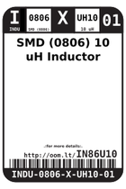
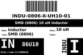

Contents
========

* [IN86U10 > SMD (0806) 10 uH Inductor](#in86u10--smd-0806-10-uh-inductor)
	* [Images](#images)
	* [Datasheets](#datasheets)
	* [Labels](#labels)
	* [EDA](#eda)
	* [Tags](#tags)

# IN86U10 > SMD (0806) 10 uH Inductor

- ID: INDU-0806-X-UH10-01
- Hex ID: IN86U10
- Name: SMD (0806) 10 uH Inductor
- Description: SMD (0806) 10 uH Inductor

## Images
  
  

|label-front|label-inventory|label-spec|
| :---: | :---: | :---: |
||||

## Datasheets

- Datasheet: [datasheet.pdf](datasheet.pdf)

## Labels
  
  

|label-front|label-inventory|label-spec|
| :---: | :---: | :---: |
||||

## EDA

### Symbols

## Tags

- oompID: INDU-0806-X-UH10-01
- name: SMD (0806) 10 uH Inductor
- hexID: IN86U10
- oompSort: INDU0806UH10
- oompType: INDU
- oompSize: 0806
- oompColor: X
- oompDesc: UH10
- oompIndex: 01
- oompVersion: 98
- ooWidth: 1.6 mm
- ooLength: 2.0 mm
- ooNumPins: 2
- ooDesignator: L1
