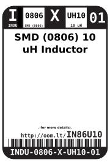
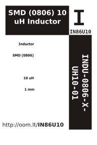

Contents
========

* [INDU-0806-X-UH10-01>SMD (0806) 10 uH Inductor](#indu-0806-x-uh10-01smd-0806-10-uh-inductor)
	* [Datasheets](#datasheets)
	* [Labels](#labels)
	* [EDA](#eda)
		* [Symbols](#symbols)
	* [Tags](#tags)

# INDU-0806-X-UH10-01>SMD (0806) 10 uH Inductor

- ID: INDU-0806-X-UH10-01
- Name: INDU-0806-X-UH10-01

## Datasheets

- Datasheet: [datasheet.pdf](datasheet.pdf)

## Labels
  
  

|Front|Inventory|Specifications|
| :---: | :---: | :---: |
||||

## EDA

### Symbols

## Tags

- hexID: IN86U10
- oompSort: INDU0806UH10
- oompType: INDU
- oompSize: 0806
- oompColor: X
- oompDesc: UH10
- oompIndex: 01
- oompVersion: 98
- ooWidth: 1.6 mm
- ooLength: 2.0 mm
- ooNumPins: 2
- ooDesignator: L1
