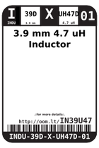
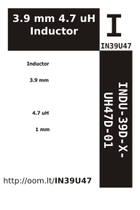

Contents
========

* [IN39U47 > 3.9 mm 4.7 uH Inductor](#in39u47--39-mm-47-uh-inductor)
	* [Datasheets](#datasheets)
	* [Labels](#labels)
	* [EDA](#eda)
	* [Images](#images)
	* [Tags](#tags)

# IN39U47 > 3.9 mm 4.7 uH Inductor

- ID: INDU-39D-X-UH47D-01
- Hex ID: IN39U47
- Name: 3.9 mm 4.7 uH Inductor
- Description: 3.9 mm 4.7 uH Inductor
- Long Link: [http://oom.lt/INDU-39D-X-UH47D-01](http://oom.lt/INDU-39D-X-UH47D-01)
- Long Link: [http://oom.lt/IN39U47](http://oom.lt/IN39U47)

## Datasheets

- Datasheet: [datasheet.pdf](datasheet.pdf)

## Labels
  
  

|label-front|label-inventory|label-spec|
| :---: | :---: | :---: |
||||

## EDA

### Symbols

## Images
  
  

|label-front|label-inventory|label-spec|
| :---: | :---: | :---: |
||||

## Tags

- oompID: INDU-39D-X-UH47D-01
- name: 3.9 mm 4.7 uH Inductor
- hexID: IN39U47
- oompSort: 
- oompClass: Surface Mount
- oompClassCode: SMDS
- oompType: INDU
- oompSize: 39D
- oompColor: X
- oompDesc: UH47D
- oompIndex: 01
- oompVersion: 40
- oompSchem: template;INDU-XXXX-X-XXXX-XX-schem
- ooDesignator: L1
