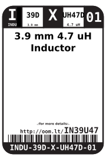
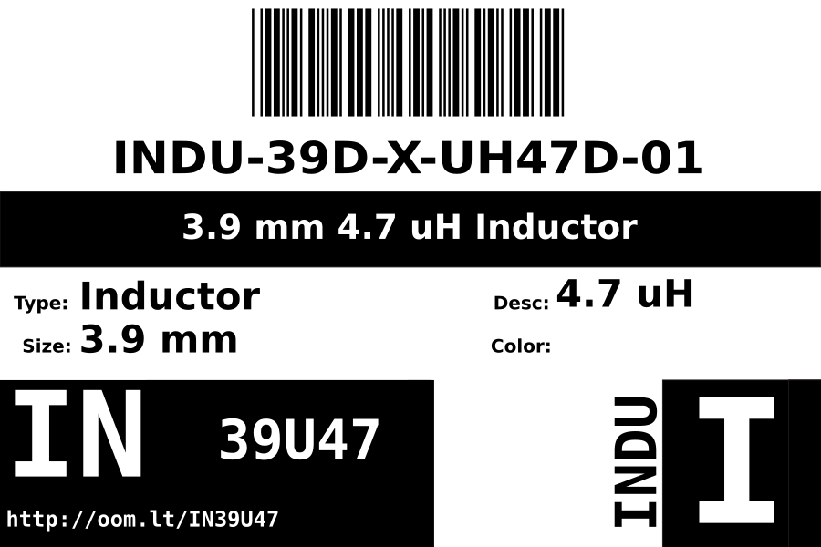
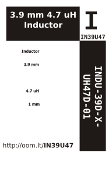

Contents
========

* [INDU-39D-X-UH47D-01>3.9 mm 4.7 uH Inductor](#indu-39d-x-uh47d-0139-mm-47-uh-inductor)
	* [Datasheets](#datasheets)
	* [Labels](#labels)
	* [EDA](#eda)
		* [Symbols](#symbols)
	* [Tags](#tags)

# INDU-39D-X-UH47D-01>3.9 mm 4.7 uH Inductor

- ID: INDU-39D-X-UH47D-01
- Name: INDU-39D-X-UH47D-01

## Datasheets

- Datasheet: [datasheet.pdf](datasheet.pdf)

## Labels
  
  

|Front|Inventory|Specifications|
| :---: | :---: | :---: |
||||

## EDA

### Symbols

## Tags

- hexID: IN39U47
- oompSort: 
- oompClass: Surface Mount
- oompClassCode: SMDS
- oompType: INDU
- oompSize: 39D
- oompColor: X
- oompDesc: UH47D
- oompIndex: 01
- oompVersion: 40
- oompSchem: template;INDU-XXXX-X-XXXX-XX-schem
- ooDesignator: L1
