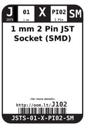
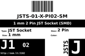

Contents
========

* [J102 > 1 mm 2 Pin JST Socket (SMD)](#j102--1-mm-2-pin-jst-socket-smd)
	* [Datasheets](#datasheets)
	* [Labels](#labels)
	* [EDA](#eda)
	* [Images](#images)
	* [Tags](#tags)
  
![][im]
# J102 > 1 mm 2 Pin JST Socket (SMD)

- ID: JSTS-01-X-PI02-SM
- Hex ID: J102
- Name: 1 mm 2 Pin JST Socket (SMD)
- Description: 1 mm 2 Pin JST Socket (SMD)
- Long Link: [http://oom.lt/JSTS-01-X-PI02-SM](http://oom.lt/JSTS-01-X-PI02-SM)
- Short Link: [http://oom.lt/J102](http://oom.lt/J102)

## Datasheets

- Datasheet: [datasheet.pdf](datasheet.pdf)

## Labels
  
  

|label-front|label-inventory|label-spec|
| :---: | :---: | :---: |
||||

## EDA

### Symbols

## Images
  
  

|image|image_RE|image_BOTTOM|label-front|label-inventory|label-spec|
| :---: | :---: | :---: | :---: | :---: | :---: |
|||||||

## Tags

- oompID: JSTS-01-X-PI02-SM
- name: 1 mm 2 Pin JST Socket (SMD)
- hexID: J102
- oompSort: JSTS0102PI
- oompType: JSTS
- oompSize: 01
- oompColor: X
- oompDesc: PI02
- oompIndex: SM
- oompVersion: 98
- ooDesignator: J1

[im]: image_450.jpg
