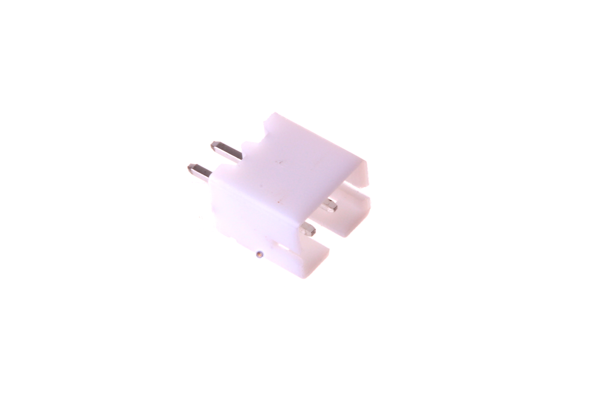
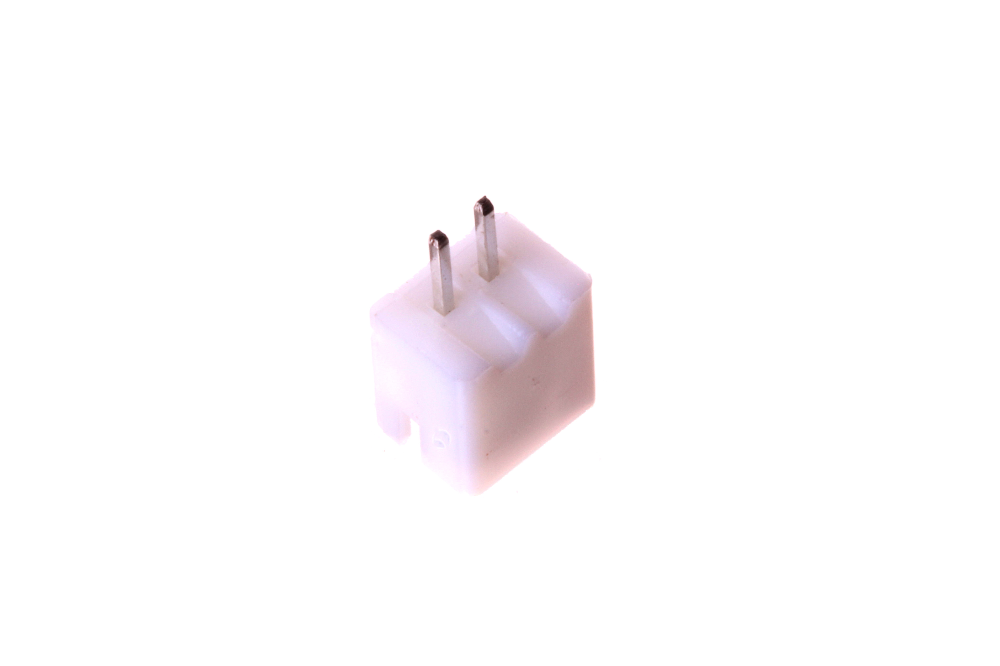
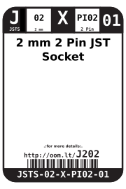
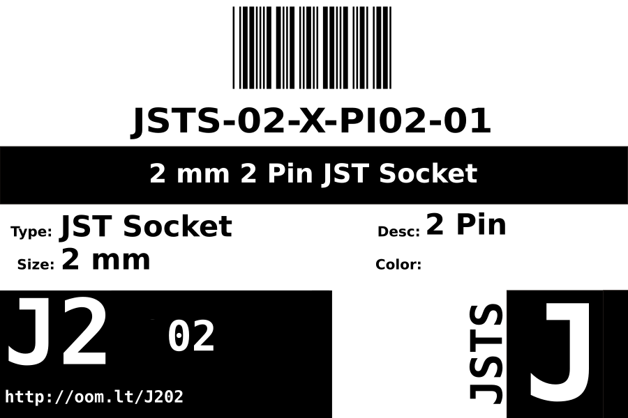
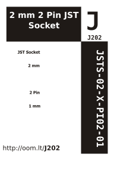

Contents
========

* [JSTS-02-X-PI02-01>2 mm 2 Pin JST Socket](#jsts-02-x-pi02-012-mm-2-pin-jst-socket)
	* [Images](#images)
	* [Datasheets](#datasheets)
	* [Labels](#labels)
	* [EDA](#eda)
		* [Symbols](#symbols)
	* [Tags](#tags)
  
![][im]
# JSTS-02-X-PI02-01>2 mm 2 Pin JST Socket

- ID: JSTS-02-X-PI02-01
- Name: JSTS-02-X-PI02-01

## Images
  
  

|Main|Reference|Bottom|
| :---: | :---: | :---: |
||||

## Datasheets

- Datasheet: [datasheet.pdf](datasheet.pdf)

## Labels
  
  

|Front|Inventory|Specifications|
| :---: | :---: | :---: |
||||

## EDA

### Symbols

## Tags

- index: 12645
- oompID: JSTS-02-X-PI02-01
- name: 2 mm 2 Pin JST Socket
- hexID: J202
- oompSort: JSTS0202PI
- oompType: JSTS
- oompSize: 02
- oompColor: X
- oompDesc: PI02
- oompIndex: 01
- oompVersion: 98
- ooDesignator: J1

[im]: image_600.jpg
