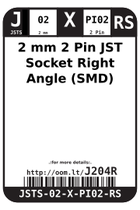

Contents
========

* [J204R > 2 mm 2 Pin JST Socket Right Angle (SMD)](#j204r--2-mm-2-pin-jst-socket-right-angle-smd)
	* [Datasheets](#datasheets)
	* [Labels](#labels)
	* [EDA](#eda)
	* [Images](#images)
	* [Tags](#tags)
  
![][im]
# J204R > 2 mm 2 Pin JST Socket Right Angle (SMD)

- ID: JSTS-02-X-PI02-RS
- Hex ID: J204R
- Name: 2 mm 2 Pin JST Socket Right Angle (SMD)
- Description: 2 mm 2 Pin JST Socket Right Angle (SMD)
- Long Link: [http://oom.lt/JSTS-02-X-PI02-RS](http://oom.lt/JSTS-02-X-PI02-RS)
- Short Link: [http://oom.lt/J204R](http://oom.lt/J204R)

## Datasheets

- Datasheet: [datasheet.pdf](datasheet.pdf)

## Labels
  
  

|label-front|label-inventory|label-spec|
| :---: | :---: | :---: |
||||

## EDA

### Symbols

## Images
  
  

|image|image_BOTTOM|label-front|label-inventory|label-spec|
| :---: | :---: | :---: | :---: | :---: |
||||||

## Tags

- oompID: JSTS-02-X-PI02-RS
- name: 2 mm 2 Pin JST Socket Right Angle (SMD)
- hexID: J204R
- oompSort: 
- oompClass: Surface Mount
- oompClassCode: SMDS
- oompType: JSTS
- oompSize: 02
- oompColor: X
- oompDesc: PI02
- oompIndex: RS
- oompVersion: 40
- ooDesignator: J1

[im]: image_450.jpg
