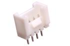

Contents
========

* [J204 > 2 mm 4 Pin JST Socket](#j204--2-mm-4-pin-jst-socket)
	* [Datasheets](#datasheets)
	* [Labels](#labels)
	* [EDA](#eda)
	* [Images](#images)
	* [Tags](#tags)
  
![][im]
# J204 > 2 mm 4 Pin JST Socket

- ID: JSTS-02-X-PI04-01
- Hex ID: J204
- Name: 2 mm 4 Pin JST Socket
- Description: 2 mm 4 Pin JST Socket
- Long Link: [http://oom.lt/JSTS-02-X-PI04-01](http://oom.lt/JSTS-02-X-PI04-01)
- Short Link: [http://oom.lt/J204](http://oom.lt/J204)

## Datasheets

- Datasheet: [datasheet.pdf](datasheet.pdf)

## Labels
  
  

|label-front|label-inventory|label-spec|
| :---: | :---: | :---: |
||||

## EDA

### Symbols

## Images
  
  

|image|image_BOTTOM|label-front|label-inventory|label-spec|
| :---: | :---: | :---: | :---: | :---: |
||||||

## Tags

- oompID: JSTS-02-X-PI04-01
- name: 2 mm 4 Pin JST Socket
- hexID: J204
- oompSort: 
- oompClass: Through Hole
- oompClassCode: THTH
- oompType: JSTS
- oompSize: 02
- oompColor: X
- oompDesc: PI04
- oompIndex: 01
- oompVersion: 40
- ooDesignator: J1

[im]: image_450.jpg
