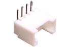
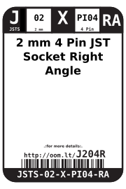
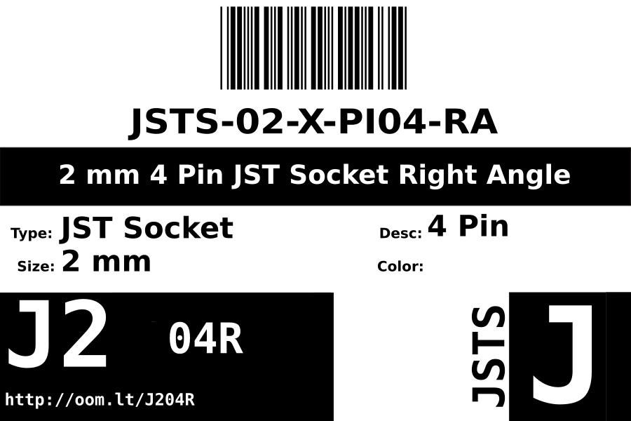
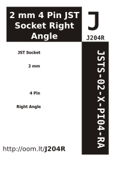

Contents
========

* [JSTS-02-X-PI04-RA>2 mm 4 Pin JST Socket Right Angle](#jsts-02-x-pi04-ra2-mm-4-pin-jst-socket-right-angle)
	* [Images](#images)
	* [Datasheets](#datasheets)
	* [Labels](#labels)
	* [EDA](#eda)
		* [Symbols](#symbols)
	* [Tags](#tags)
  
![][im]
# JSTS-02-X-PI04-RA>2 mm 4 Pin JST Socket Right Angle

- ID: JSTS-02-X-PI04-RA
- Name: JSTS-02-X-PI04-RA

## Images
  
  

|image|image_BOTTOM|
| :---: | :---: |
|||

## Datasheets

- Datasheet: [datasheet.pdf](datasheet.pdf)

## Labels
  
  

|label-front|label-inventory|label-spec|
| :---: | :---: | :---: |
||||

## EDA

### Symbols

## Tags

- oompID: JSTS-02-X-PI04-RA
- name: 2 mm 4 Pin JST Socket Right Angle
- hexID: J204R
- oompSort: 
- oompClass: Through Hole
- oompClassCode: THTH
- oompType: JSTS
- oompSize: 02
- oompColor: X
- oompDesc: PI04
- oompIndex: RA
- oompVersion: 40
- ooDesignator: J1

[im]: image_600.jpg
