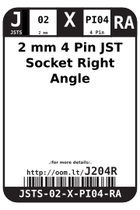

Contents
========

* [J204R > 2 mm 4 Pin JST Socket Right Angle](#j204r--2-mm-4-pin-jst-socket-right-angle)
	* [Datasheets](#datasheets)
	* [Labels](#labels)
	* [EDA](#eda)
	* [Images](#images)
	* [Tags](#tags)
  
![][im]
# J204R > 2 mm 4 Pin JST Socket Right Angle

- ID: JSTS-02-X-PI04-RA
- Hex ID: J204R
- Name: 2 mm 4 Pin JST Socket Right Angle
- Description: 2 mm 4 Pin JST Socket Right Angle
- Long Link: [http://oom.lt/JSTS-02-X-PI04-RA](http://oom.lt/JSTS-02-X-PI04-RA)
- Long Link: [http://oom.lt/J204R](http://oom.lt/J204R)

## Datasheets

- Datasheet: [datasheet.pdf](datasheet.pdf)

## Labels
  
  

|label-front|label-inventory|label-spec|
| :---: | :---: | :---: |
||||

## EDA

### Symbols

## Images
  
  

|image|image_BOTTOM|label-front|label-inventory|label-spec|
| :---: | :---: | :---: | :---: | :---: |
||||||

## Tags

- oompID: JSTS-02-X-PI04-RA
- name: 2 mm 4 Pin JST Socket Right Angle
- hexID: J204R
- oompSort: 
- oompClass: Through Hole
- oompClassCode: THTH
- oompType: JSTS
- oompSize: 02
- oompColor: X
- oompDesc: PI04
- oompIndex: RA
- oompVersion: 40
- ooDesignator: J1

[im]: image_450.jpg
