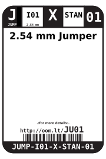
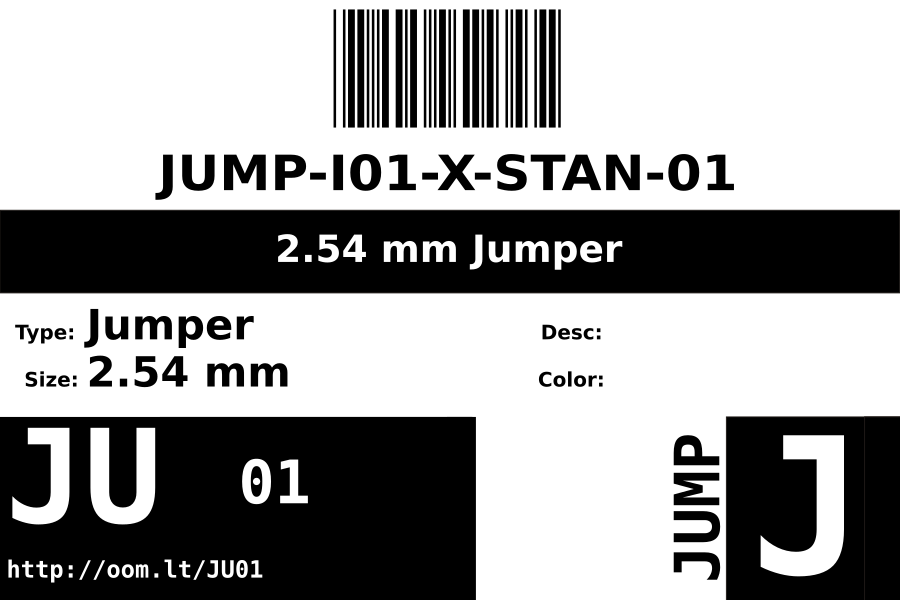
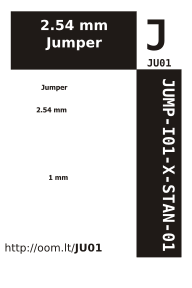

Contents
========

* [JUMP-I01-X-STAN-01>2.54 mm Jumper](#jump-i01-x-stan-01254-mm-jumper)
	* [Images](#images)
	* [Datasheets](#datasheets)
	* [Labels](#labels)
	* [EDA](#eda)
		* [Symbols](#symbols)
	* [Tags](#tags)
  
![][im]
# JUMP-I01-X-STAN-01>2.54 mm Jumper

- ID: JUMP-I01-X-STAN-01
- Name: JUMP-I01-X-STAN-01

## Images
  
  

|image|
| :---: |
||

## Datasheets

- Datasheet: [datasheet.pdf](datasheet.pdf)

## Labels
  
  

|label-front|label-inventory|label-spec|
| :---: | :---: | :---: |
||||

## EDA

### Symbols

## Tags

- oompID: JUMP-I01-X-STAN-01
- name: 2.54 mm Jumper
- hexID: JU01
- oompSort: 
- oompClass: Through Hole
- oompClassCode: THTH
- oompType: JUMP
- oompSize: I01
- oompColor: X
- oompDesc: STAN
- oompIndex: 01
- oompVersion: 40

[im]: image_600.jpg
