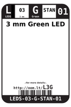
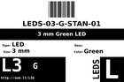
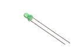
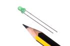

Contents
========

* [L3G > 3 mm Green LED](#l3g--3-mm-green-led)
	* [Datasheets](#datasheets)
	* [Labels](#labels)
	* [EDA](#eda)
	* [Images](#images)
	* [Tags](#tags)
  
![][im]
# L3G > 3 mm Green LED

- ID: LEDS-03-G-STAN-01
- Hex ID: L3G
- Name: 3 mm Green LED
- Description: 3 mm Green LED
- Long Link: [http://oom.lt/LEDS-03-G-STAN-01](http://oom.lt/LEDS-03-G-STAN-01)
- Short Link: [http://oom.lt/L3G](http://oom.lt/L3G)

## Datasheets

- Datasheet: [datasheet.pdf](datasheet.pdf)

## Labels
  
  

|label-front|label-inventory|label-spec|
| :---: | :---: | :---: |
||||

## EDA

### Symbols

## Images
  
  

|image|image_RE|label-front|label-inventory|label-spec|
| :---: | :---: | :---: | :---: | :---: |
||||||

## Tags

- oompID: LEDS-03-G-STAN-01
- name: 3 mm Green LED
- hexID: L3G
- oompSort: 
- oompClass: Through Hole
- oompClassCode: THTH
- oompType: LEDS
- oompSize: 03
- oompColor: G
- oompDesc: STAN
- oompIndex: 01
- oompVersion: 40
- oompBbls: template;LEDS-03-X-XXXX-01-bbls
- oompDiag: template;LEDS-03-X-XXXX-01-diag
- oompIden: template;LEDS-03-X-XXXX-01-iden
- oompSchem: template;LEDS-XXXX-X-XXXX-XX-schem
- oompSimp: template;LEDS-03-X-XXXX-01-simp
- ooDesignator: D1

[im]: image_450.jpg
