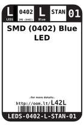
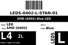
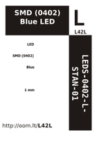
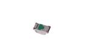

Contents
========

* [L42L > SMD (0402) Blue LED](#l42l--smd-0402-blue-led)
	* [Datasheets](#datasheets)
	* [Labels](#labels)
	* [EDA](#eda)
	* [Images](#images)
	* [Tags](#tags)
  
![][im]
# L42L > SMD (0402) Blue LED

- ID: LEDS-0402-L-STAN-01
- Hex ID: L42L
- Name: SMD (0402) Blue LED
- Description: SMD (0402) Blue LED
- Long Link: [http://oom.lt/LEDS-0402-L-STAN-01](http://oom.lt/LEDS-0402-L-STAN-01)
- Long Link: [http://oom.lt/L42L](http://oom.lt/L42L)

## Datasheets

- Datasheet: [datasheet.pdf](datasheet.pdf)

## Labels
  
  

|label-front|label-inventory|label-spec|
| :---: | :---: | :---: |
||||

## EDA

### Symbols

## Images
  
  

|image|image_BOTTOM|label-front|label-inventory|label-spec|
| :---: | :---: | :---: | :---: | :---: |
||||||

## Tags

- oompID: LEDS-0402-L-STAN-01
- name: SMD (0402) Blue LED
- hexID: L42L
- oompSort: 
- oompClass: Surface Mount
- oompClassCode: SMDS
- oompType: LEDS
- oompSize: 0402
- oompColor: L
- oompDesc: STAN
- oompIndex: 01
- oompVersion: 40
- oompBbls: template;XXXX-0402-X-XXXX-XX-bbls
- oompDiag: template;XXXX-0402-X-XXXX-XX-diag
- oompIden: template;XXXX-0402-X-XXXX-XX-iden
- oompSchem: template;LEDS-XXXX-X-XXXX-XX-schem
- ooDesignator: D1

[im]: image_450.jpg
