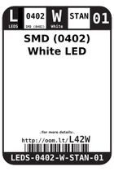
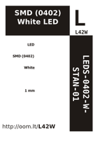

Contents
========

* [L42W > SMD (0402) White LED](#l42w--smd-0402-white-led)
	* [Datasheets](#datasheets)
	* [Labels](#labels)
	* [EDA](#eda)
	* [Images](#images)
	* [Tags](#tags)

# L42W > SMD (0402) White LED

- ID: LEDS-0402-W-STAN-01
- Hex ID: L42W
- Name: SMD (0402) White LED
- Description: SMD (0402) White LED
- Long Link: [http://oom.lt/LEDS-0402-W-STAN-01](http://oom.lt/LEDS-0402-W-STAN-01)
- Short Link: [http://oom.lt/L42W](http://oom.lt/L42W)

## Datasheets

- Datasheet: [datasheet.pdf](datasheet.pdf)

## Labels
  
  

|label-front|label-inventory|label-spec|
| :---: | :---: | :---: |
||||

## EDA

### Footprints
  

|[  FOOTPRINT-kicad-kicad-footprints-LED_SMD-LED_0402_1005Metric](https://github.com/oomlout/oomlout_OOMP_eda/tree/main/FOOTPRINT/kicad/kicad-footprints/LED_SMD/LED_0402_1005Metric/)|[  FOOTPRINT-kicad-kicad-footprints-LED_SMD-LED_0402_1005Metric_Pad0.77x0.64mm_HandSolder](https://github.com/oomlout/oomlout_OOMP_eda/tree/main/FOOTPRINT/kicad/kicad-footprints/LED_SMD/LED_0402_1005Metric_Pad0.77x0.64mm_HandSolder/)|||
| :---: | :---: | :---: | :---: |

### Symbols
  

|[  SYMBOL-kicad-kicad-symbols-Device-LED](https://github.com/oomlout/oomlout_OOMP_eda/tree/main/SYMBOL/kicad/kicad-symbols/Device/LED/)||||
| :---: | :---: | :---: | :---: |

## Images
  
  

|label-front|label-inventory|label-spec|
| :---: | :---: | :---: |
||||

## Tags

- oompID: LEDS-0402-W-STAN-01
- name: SMD (0402) White LED
- hexID: L42W
- oompSort: 
- oompClass: Surface Mount
- oompClassCode: SMDS
- oompType: LEDS
- oompSize: 0402
- oompColor: W
- oompDesc: STAN
- oompIndex: 01
- oompVersion: 40
- oompBbls: template;XXXX-0402-X-XXXX-XX-bbls
- oompDiag: template;XXXX-0402-X-XXXX-XX-diag
- oompIden: template;XXXX-0402-X-XXXX-XX-iden
- oompSchem: template;LEDS-XXXX-X-XXXX-XX-schem
- ooDesignator: D1
- footprintKicad: FOOTPRINT-kicad-kicad-footprints-LED_SMD-LED_0402_1005Metric
- footprintKicad: FOOTPRINT-kicad-kicad-footprints-LED_SMD-LED_0402_1005Metric_Pad0.77x0.64mm_HandSolder
- symbolKicad: SYMBOL-kicad-kicad-symbols-Device-LED
