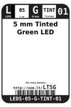
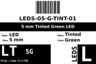
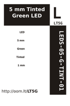
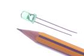

Contents
========

* [LT5G > 5 mm Tinted Green LED](#lt5g--5-mm-tinted-green-led)
	* [Datasheets](#datasheets)
	* [Labels](#labels)
	* [EDA](#eda)
	* [Images](#images)
	* [Tags](#tags)
  
![][im]
# LT5G > 5 mm Tinted Green LED

- ID: LEDS-05-G-TINT-01
- Hex ID: LT5G
- Name: 5 mm Tinted Green LED
- Description: 5 mm Tinted Green LED
- Long Link: [http://oom.lt/LEDS-05-G-TINT-01](http://oom.lt/LEDS-05-G-TINT-01)
- Short Link: [http://oom.lt/LT5G](http://oom.lt/LT5G)

## Datasheets

- Datasheet: [datasheet.pdf](datasheet.pdf)

## Labels
  
  

|label-front|label-inventory|label-spec|
| :---: | :---: | :---: |
||||

## EDA

### Symbols

## Images
  
  

|image|image_RE|label-front|label-inventory|label-spec|
| :---: | :---: | :---: | :---: | :---: |
||||||

## Tags

- oompID: LEDS-05-G-TINT-01
- name: 5 mm Tinted Green LED
- hexID: LT5G
- oompSort: 0505ZTINTG
- oompType: LEDS
- oompSize: 05
- oompColor: G
- oompDesc: TINT
- oompIndex: 01
- oompVersion: 99
- oompClass: Through Hole Component
- oompClassCode: THTH
- oompBbls: template;LEDS-05-X-XXXX-01-bbls
- oompDiag: template;LEDS-05-X-XXXX-01-diag
- oompIden: template;LEDS-05-X-XXXX-01-iden
- oompSchem: template;LEDS-XXXX-X-XXXX-XX-schem
- oompSimp: template;LEDS-05-X-XXXX-01-simp
- ooDesignator: D1

[im]: image_450.jpg
